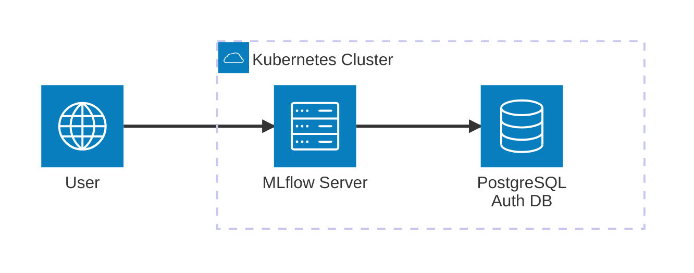
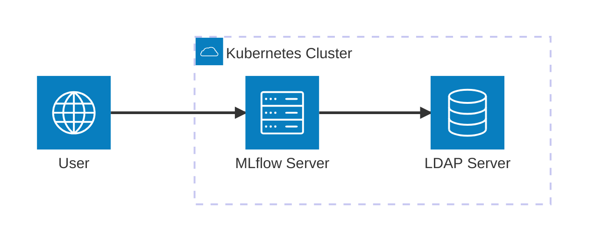
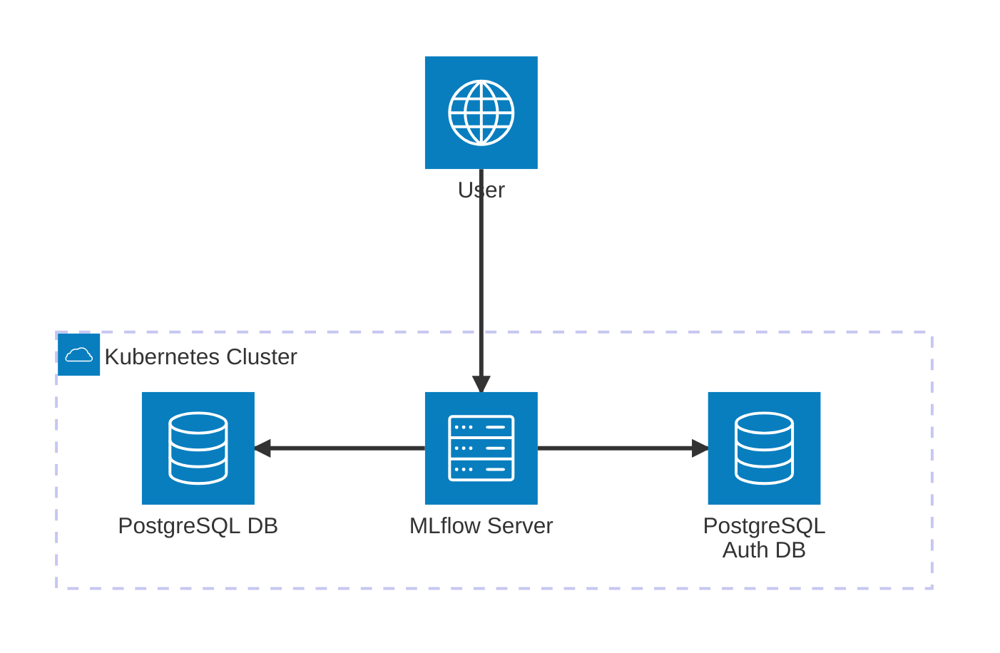
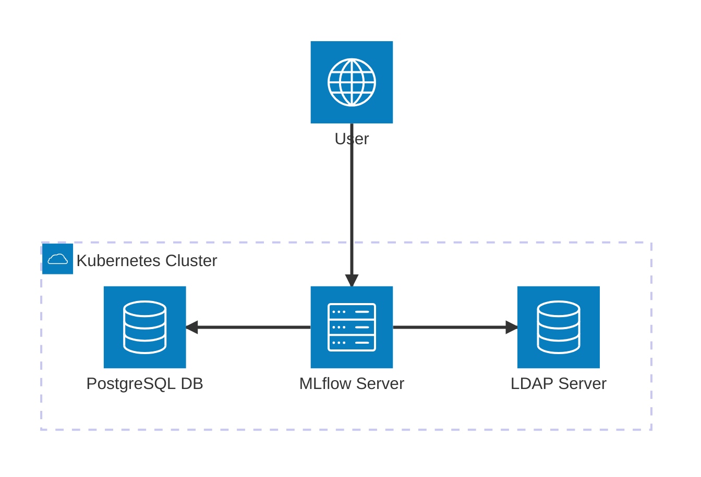

# Authentication Configuration

This guide covers configuring authentication for MLflow to secure access to your MLflow tracking server. MLflow supports various authentication methods including basic authentication, and LDAP integration.

:::warning
**Security Requirement:** Authentication should always be enabled in production environments to secure your MLflow instance and protect sensitive ML data.
:::

:::danger
**Production Security:** Never deploy MLflow without authentication in production. Unsecured MLflow instances can expose sensitive model data and credentials.
:::

## Prerequisites

:::info
**Setup Requirements:** Ensure you have the necessary infrastructure and access before configuring authentication.
:::

- MLflow deployed on Kubernetes
- Access to MLflow configuration
- Authentication provider setup (if using LDAP)

:::tip
**Planning:** Choose the authentication method that best fits your organization's security policies and infrastructure.
:::

## Basic Authentication

:::tip
**Quick Security:** Basic authentication is the simplest way to secure MLflow and is suitable for small teams or development environments.
:::

:::warning
**Basic Auth Limitations:** Basic authentication stores credentials in plain text and doesn't support advanced features like password policies or account lockout.
:::

### 1. Simple Basic Authentication

```yaml
auth:
  enabled: true
  adminUsername: admin
  adminPassword: S3cr3+
```

:::warning
**Password Security:** Use strong, unique passwords and consider using Kubernetes secrets instead of hardcoding credentials.
:::

:::danger
**Credential Management:** Never hardcode passwords in configuration files. Use Kubernetes secrets for all sensitive data.
:::

### 2. Create User Credentials Secret

```bash
kubectl create secret generic mlflow-auth \
  --namespace mlflow \
  --from-literal=admin-user=admin \
  --from-literal=admin-password=your-secure-password
```

:::tip
**Secret Management:** Using Kubernetes secrets provides better security and makes credential rotation easier.
:::

### 3. Configure Basic Authentication with Secret

```yaml
auth:
  enabled: true
  adminUsername: admin
  adminPassword: your-secure-password
  defaultPermission: READ
  appName: basic-auth
  authorizationFunction: mlflow.server.auth:authenticate_request_basic_auth
  configPath: /etc/mlflow/auth/
  configFile: basic_auth.ini
  sqliteFile: basic_auth.db
  sqliteFullPath: ""
```

:::info
**Permission Levels:** Configure appropriate default permissions based on your team's access requirements.
:::

## PostgreSQL-Based Centralized Authentication



:::info
**Enterprise Authentication:** PostgreSQL-based authentication provides centralized user management and is suitable for larger organizations.
:::

:::tip
**Scalability:** PostgreSQL authentication scales better than SQLite for organizations with many users.
:::

### 1. Configure PostgreSQL Auth Backend

```yaml
auth:
  enabled: true
  adminUsername: admin
  adminPassword: S3cr3+
  postgres:
    enabled: true
    host: postgresql--auth-instance1.abcdef1234.eu-central-1.rds.amazonaws.com
    port: 5432
    database: auth
    user: mlflowauth
    password: A4m1nPa33w0rd!
    driver: psycopg2
```

:::warning
**Database Security:** Ensure the PostgreSQL instance is properly secured with network policies and strong authentication.
:::

### 2. Create Auth Database

```sql
CREATE DATABASE auth;
CREATE USER mlflowauth WITH PASSWORD 'A4m1nPa33w0rd!';
GRANT ALL PRIVILEGES ON DATABASE auth TO mlflowauth;
```

:::tip
**Database Setup:** Use dedicated databases for authentication to isolate security concerns and simplify management.
:::

## LDAP Authentication



:::info
**Enterprise Integration:** LDAP authentication integrates MLflow with existing enterprise directory services for centralized user management.
:::

:::tip
**Single Sign-On:** LDAP integration enables users to access MLflow with their existing enterprise credentials.
:::

### 1. Basic LDAP Configuration

```yaml
ldapAuth:
  enabled: true
  uri: ldap://lldap:3890/dc=mlflow,dc=test
  tlsVerification: required
  lookupBind: uid=%s,ou=people,dc=mlflow,dc=test
  groupAttribute: dn
  searchBaseDistinguishedName: ou=groups,dc=mlflow,dc=test
  searchFilter: "(&(objectclass=groupOfUniqueNames)(uniquemember=%s))"
  adminGroupDistinguishedName: cn=test-admin,ou=groups,dc=mlflow,dc=test
  userGroupDistinguishedName: cn=test-user,ou=groups,dc=mlflow,dc=test
```

:::warning
**LDAP Security:** Always use TLS/SSL for LDAP connections in production to protect user credentials in transit.
:::

### 2. LDAP with Self-Signed CA Certificate

If you use self-signed certificate for your LDAP server:

```yaml
ldapAuth:
  enabled: true
  uri: ldap://lldap:3890/dc=mlflow,dc=test
  tlsVerification: required
  lookupBind: uid=%s,ou=people,dc=mlflow,dc=test
  groupAttribute: dn
  searchBaseDistinguishedName: ou=groups,dc=mlflow,dc=test
  searchFilter: "(&(objectclass=groupOfUniqueNames)(uniquemember=%s))"
  adminGroupDistinguishedName: cn=test-admin,ou=groups,dc=mlflow,dc=test
  userGroupDistinguishedName: cn=test-user,ou=groups,dc=mlflow,dc=test
  encodedTrustedCACertificate: "LS0tLS1CRUdJTiBDRVJUSUZJQ0FURS0tLS0tCk1JSURoRENDQW15Z0F3SUJBZ0lSQUx1a3VyZnlCMFF0Z1FtbnphZDlMNWN3RFFZSktvWklodmNOQVFFTEJRQXcKU3pFZ01CNEdBMVVFQXd3WFRVeEdiRzkzSUV4RVFWQXRVMU5NTFZSbGMzUWdRMEV4RHpBTkJnTlZCQW9NQmsxTQpSbXh2ZHpFV01CUUdBMVVFQ3d3TlRFUkJVQzFUVTB3dFZHVnpkREFlRncweU5UQXpNRE14TnpJMU1qVmFGdzB5Ck5UQXpNRFF4TnpJMU1qVmFNRXN4SURBZUJnTlZCQU1NRjAxTVJteHZkeUJNUkVGUUxWTlRUQzFVWlhOMElFTkIKTVE4d0RRWURWUVFLREFaTlRFWnNiM2N4RmpBVUJnTlZCQXNNRFV4RVFWQXRVMU5NTFZSbGMzUXdnZ0VpTUEwRwpDU3FHU0liM0RRRUJBUVVBQTRJQkR3QXdnZ0VLQW9JQkFRRHNBNDc1NkRrZlVXRThZZjRHN0Z4ZFJkL0pnNXNkCjRJUVp1K3ZQcDRMTm5uM3E5VWlZeUtHZkVFRDJTMnRvYUVTS1VNakJyYWVRd3crUDV0dDVHcjNMQ3JQUmpjZTUKQ2xuMEh3NE5pRGJ5bkhWcDkxWXRjdHJObWtGMFRGdUYxNVE5OUMyR1lpbmNYUW93THduMWZXN2pTZjFuU3N1Kwpvek0veHFUa2FyQndtcVFkYTRlcW56cG5Xa2ZqL2ZHQTNVcnpwMHV6ZG1ZdnNhcmtiTkt0aGZSWTJ4UDhQZGc0Cm15dDJ6SmlycjN2MEo1OFNHeFN6ZWlab0tYUTNtTW5hRDZGTUVTcEg5THUydDVTRUVPZjlubFJLS2l4UzF0aWMKVHJUMDkzUVNKcWNRRkMyNTNwWmF1ZkpQNWR2SlVIR0NvcHFzVU5xc0Jkd2Ivd1grNnJFQm5YYUJBZ01CQUFHagpZekJoTUE4R0ExVWRFd0VCL3dRRk1BTUJBZjh3RGdZRFZSMFBBUUgvQkFRREFnRUdNQjBHQTFVZERnUVdCQlJsCnZVRmphb0c5NU1sWmxBSUs2SDRsaVlvMUNqQWZCZ05WSFNNRUdEQVdnQlJsdlVGamFvRzk1TWxabEFJSzZINGwKaVlvMUNqQU5CZ2txaGtpRzl3MEJBUXNGQUFPQ0FRRUFCNy96YWtlOHB6QWF3eHhvUW5mV3N1MkpSNWhyZkpjcQpjdCt1UEVnSWdnc3lFSmRGbndvbSt2UUV3a3NnT2tEYk10UGZnWTdRUVdUeHo4d1pQOXJDZVZaVUJ0T1FrdytKCjZCR2NLc1gwVnl5bUx5a1VOWUF5U2pEUE1Ma0NES2ZsRyt2eWFPWTZQbFdkZVJJTTVRMVZRL1B1SmQrbCtobEgKd2dFbU1RK2VjeVB2Wkhnd0t3cE41Zzh3YzI3bjI3RURqS29wUHpFMXpzRFN0MjFwUnMvcUdnZXZ6QTl2RlB5eAprWXdXdWJkblQ5NkwyTUUrVjcwTmJzbWt5ekl2T2NzajBlRnE0Z2EyNUQxQ2FhLzlyUnVOSlhwanYyQndYUm1tClNDNnBIV1dRWnh3NDRLQnJCM09EM1hLS25rMU94RFBDUzVwMzN2SHo4ZEZOMHNzb3EwV1VPUT09Ci0tLS0tRU5EIENFUlRJRklDQVRFLS0tLS0K"
```

:::warning
**Certificate Security:** Always use proper TLS certificates in production. Self-signed certificates should only be used for testing.
:::

:::danger
**Certificate Management:** Store CA certificates securely and rotate them regularly according to your security policies.
:::

### 3. LDAP with External CA Certificate Secret

If you already stored your self-signed CA certificate in an external secret:

```yaml
ldapAuth:
  enabled: true
  uri: ldap://lldap:3890/dc=mlflow,dc=test
  tlsVerification: required
  lookupBind: uid=%s,ou=people,dc=mlflow,dc=test
  groupAttribute: dn
  searchBaseDistinguishedName: ou=groups,dc=mlflow,dc=test
  searchFilter: "(&(objectclass=groupOfUniqueNames)(uniquemember=%s))"
  adminGroupDistinguishedName: cn=test-admin,ou=groups,dc=mlflow,dc=test
  userGroupDistinguishedName: cn=test-user,ou=groups,dc=mlflow,dc=test
  externalSecretForTrustedCACertificate: external-ca-certificate-secret
```

:::tip
**Secret Management:** Using external secrets for certificates provides better security and easier certificate rotation.
:::

## Complete Configuration Examples

:::info
**Production Examples:** These examples demonstrate complete authentication setups for different enterprise scenarios.
:::

### Basic Authentication with PostgreSQL Backend



```yaml
backendStore:
  databaseMigration: true
  databaseConnectionCheck: true
  postgres:
    enabled: true
    host: postgresql-instance.cg034hpkmmjt.eu-central-1.rds.amazonaws.com
    port: 5432
    database: mlflow
    user: mlflowuser
    password: Pa33w0rd!

auth:
  enabled: true
  adminUsername: admin
  adminPassword: S3cr3+
  postgres:
    enabled: true
    host: postgresql-auth-instance.cg034hpkmmjt.eu-central-1.rds.amazonaws.com
    port: 5432
    database: auth
    user: mlflowauth
    password: A4m1nPa33w0rd!
    driver: psycopg2

ingress:
  enabled: true
  hosts:
    - host: mlflow.your-domain.com
      paths:
        - path: /
          pathType: ImplementationSpecific
```

### LDAP Authentication with PostgreSQL Backend



```yaml
backendStore:
  databaseMigration: true
  databaseConnectionCheck: true
  postgres:
    enabled: true
    host: postgresql-instance.cg034hpkmmjt.eu-central-1.rds.amazonaws.com
    port: 5432
    database: mlflow
    user: mlflowuser
    password: Pa33w0rd!

ldapAuth:
  enabled: true
  uri: ldap://lldap:3890/dc=mlflow,dc=test
  tlsVerification: required
  lookupBind: uid=%s,ou=people,dc=mlflow,dc=test
  groupAttribute: dn
  searchBaseDistinguishedName: ou=groups,dc=mlflow,dc=test
  searchFilter: "(&(objectclass=groupOfUniqueNames)(uniquemember=%s))"
  adminGroupDistinguishedName: cn=test-admin,ou=groups,dc=mlflow,dc=test
  userGroupDistinguishedName: cn=test-user,ou=groups,dc=mlflow,dc=test
```

### Production Authentication with S3 and Monitoring

```yaml
backendStore:
  databaseMigration: true
  databaseConnectionCheck: true
  postgres:
    enabled: true
    host: postgresql-instance1.cg034hpkmmjt.eu-central-1.rds.amazonaws.com
    port: 5432
    database: mlflow
    user: mlflowuser
    password: Pa33w0rd!

artifactRoot:
  s3:
    enabled: true
    bucket: my-mlflow-artifact-root-backend
    awsAccessKeyId: a1b2c3d4
    awsSecretAccessKey: a1b2c3d4

auth:
  enabled: true
  adminUsername: admin
  adminPassword: S3cr3+
  postgres:
    enabled: true
    host: postgresql--auth-instance1.abcdef1234.eu-central-1.rds.amazonaws.com
    port: 5432
    database: auth
    user: mlflowauth
    password: A4m1nPa33w0rd!
    driver: psycopg2

serviceMonitor:
  enabled: true
  namespace: monitoring
  interval: 30s
  telemetryPath: /metrics
  labels:
    release: prometheus
  timeout: 10s
  targetLabels: []

ingress:
  enabled: true
  className: nginx
  hosts:
    - host: mlflow.your-domain.com
      paths:
        - path: /
          pathType: Prefix
  tls:
    - secretName: mlflow-tls
      hosts:
        - mlflow.your-domain.com
```

## Ingress with Authentication

### 1. Configure Ingress with Auth

```yaml
ingress:
  enabled: true
  className: nginx
  annotations:
    nginx.ingress.kubernetes.io/auth-type: basic
    nginx.ingress.kubernetes.io/auth-secret: mlflow-auth
    nginx.ingress.kubernetes.io/auth-realm: "MLflow Authentication Required"
  hosts:
    - host: mlflow.your-domain.com
      paths:
        - path: /
          pathType: Prefix
```

### 2. Create Ingress Auth Secret

```bash
kubectl create secret generic mlflow-auth \
  --namespace mlflow \
  --from-literal=auth=admin:$apr1$hash_of_password
```

## Security Best Practices

### 1. Use HTTPS

Configure TLS for secure communication:

```yaml
ingress:
  enabled: true
  tls:
    - secretName: mlflow-tls
      hosts:
        - mlflow.your-domain.com
```

### 2. Implement Rate Limiting

```yaml
ingress:
  annotations:
    nginx.ingress.kubernetes.io/rate-limit: "100"
    nginx.ingress.kubernetes.io/rate-limit-window: "1m"
```

## Monitoring Authentication

### 1. Enable Auth Logging

```yaml
extraEnvVars:
  MLFLOW_LOGGING_LEVEL: "INFO"  # MLflow logging level
  MLFLOW_CONFIGURE_LOGGING: "true"  # Configure MLflow logging on import
```

### 2. Configure Audit Logs

```yaml
extraEnvVars:
  MLFLOW_LOGGING_LEVEL: "DEBUG"  # Enable detailed logging for audit purposes
  MLFLOW_ENABLE_SYSTEM_METRICS_LOGGING: "true"  # Enable system metrics for monitoring
```

## Troubleshooting

### Common Issues

1. **Authentication Failed**: Check credentials and authentication provider configuration
2. **LDAP Connection Problems**: Check LDAP server connectivity and credentials
3. **Session Issues**: Verify session timeout and cookie settings
4. **PostgreSQL Auth Backend Issues**: Verify database connectivity and permissions

### Debug Commands

```bash
# Check authentication configuration
kubectl exec -it deployment/mlflow -n mlflow -- env | grep MLFLOW

# View authentication logs
kubectl logs deployment/mlflow -n mlflow | grep -i "auth\|login"

# Test authentication endpoint
kubectl port-forward svc/mlflow -n mlflow 5000:5000
curl -u admin:password http://localhost:5000/health

# Check LDAP connectivity
kubectl exec -it deployment/mlflow -n mlflow -- \
  ldapsearch -H ldap://your-ldap-server:389 -D "uid=test,ou=people,dc=example,dc=com" -w password -b "dc=example,dc=com"
```

## Next Steps

:::tip
**Getting Started:** Follow these guides to enhance your MLflow security setup.
:::

- [Basic Installation](/docs/charts/mlflow/basic-installation) - Set up MLflow with authentication
- [PostgreSQL Backend Installation](/docs/charts/mlflow/postgresql-backend-installation) - Production database setup
- [Autoscaling Setup](/docs/charts/mlflow/autoscaling-setup) - Scale with authentication
- [Monitoring Setup](/docs/charts/mlflow/troubleshooting-and-monitoring) - Monitor authentication events

:::info
**Security Enhancement:** Consider implementing additional security measures like OAuth, SAML, or multi-factor authentication for enhanced security.
:::