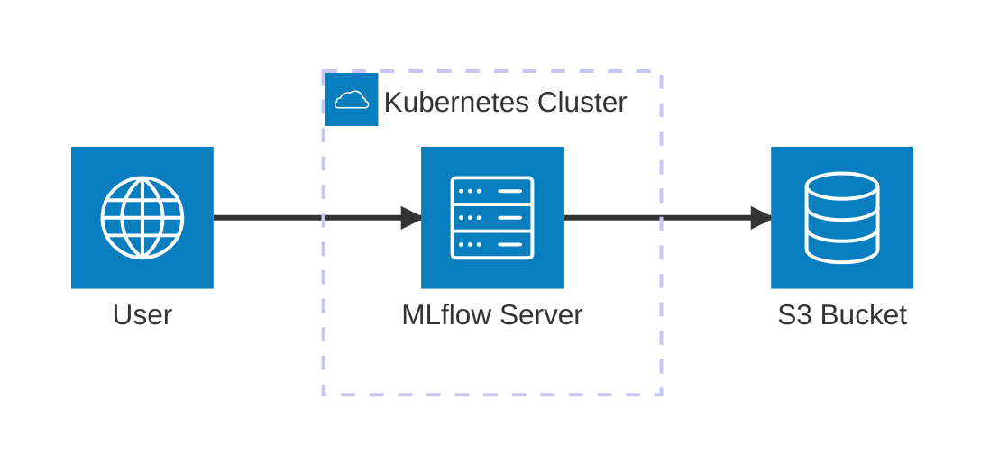
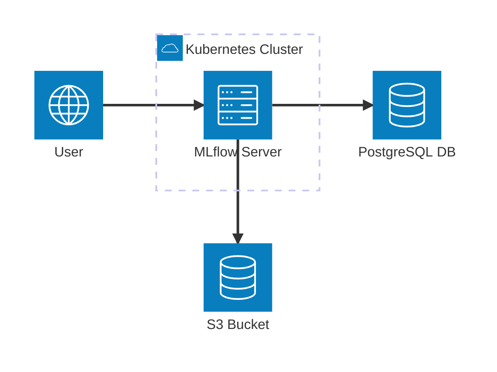
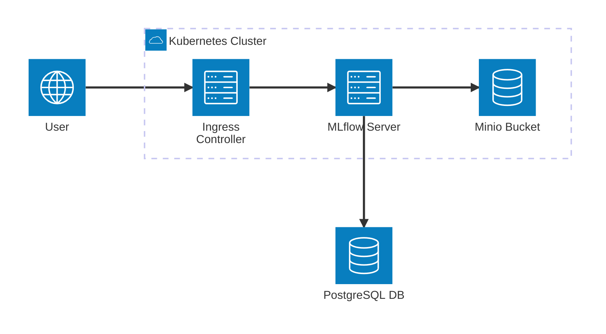
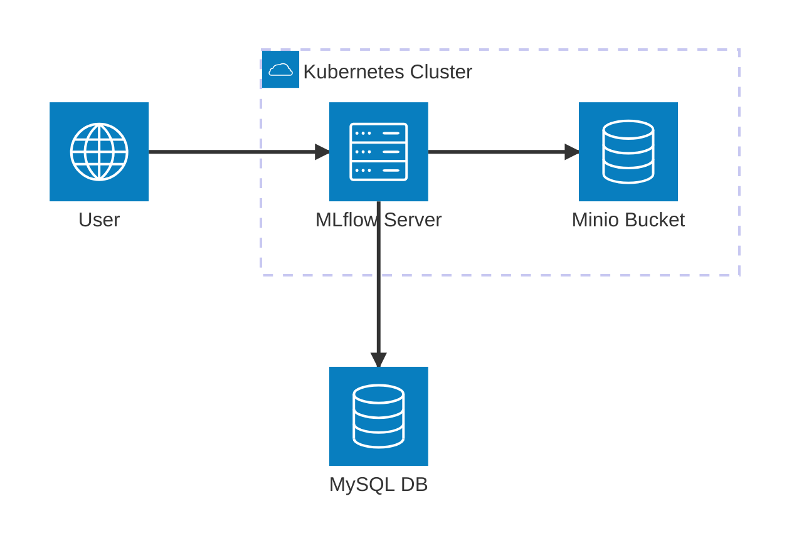

# AWS S3 Integration

This guide covers configuring MLflow to use AWS S3 for artifact storage. S3 provides scalable, durable storage for MLflow artifacts like models, datasets, and experiment outputs.

:::info
**Enterprise Storage:** AWS S3 is the most popular cloud storage solution for MLflow artifacts, providing high availability, durability, and scalability for production deployments.
:::



## Prerequisites

:::warning
**AWS Setup:** Ensure you have proper AWS access and permissions before configuring S3 integration.
:::

- AWS account with S3 access
- AWS CLI configured or AWS credentials available
- Kubernetes cluster with MLflow deployed
- IAM permissions for S3 operations

## S3 Bucket Setup

:::tip
**Bucket Configuration:** Proper bucket setup ensures data durability and cost optimization for your MLflow artifacts.
:::

### 1. Create S3 Bucket

```bash
aws s3 mb s3://your-mlflow-artifacts-bucket
```

### 2. Configure Bucket Versioning (Recommended)

```bash
aws s3api put-bucket-versioning \
  --bucket your-mlflow-artifacts-bucket \
  --versioning-configuration Status=Enabled
```

:::tip
**Versioning:** Enable versioning to protect against accidental deletions and maintain artifact history.
:::

### 3. Configure Bucket Lifecycle (Optional)

```bash
aws s3api put-bucket-lifecycle-configuration \
  --bucket your-mlflow-artifacts-bucket \
  --lifecycle-configuration '{
    "Rules": [
      {
        "ID": "DeleteOldVersions",
        "Status": "Enabled",
        "Filter": {},
        "NoncurrentVersionExpiration": {
          "NoncurrentDays": 30
        }
      }
    ]
  }'
```

:::info
**Lifecycle Management:** Configure lifecycle policies to automatically manage storage costs and clean up old artifacts.
:::

## IAM Configuration

:::warning
**Security Best Practice:** Use IAM roles instead of access keys for production deployments to improve security and eliminate credential management.
:::

### Option 1: IAM User (Development)

Create an IAM user with S3 permissions:

```json
{
  "Version": "2012-10-17",
  "Statement": [
    {
      "Effect": "Allow",
      "Action": [
        "s3:GetObject",
        "s3:PutObject",
        "s3:DeleteObject",
        "s3:ListBucket"
      ],
      "Resource": [
        "arn:aws:s3:::your-mlflow-artifacts-bucket",
        "arn:aws:s3:::your-mlflow-artifacts-bucket/*"
      ]
    }
  ]
}
```

### Option 2: IAM Role (Production)

Create an IAM role for Kubernetes service accounts:

```json
{
  "Version": "2012-10-17",
  "Statement": [
    {
      "Effect": "Allow",
      "Principal": {
        "Federated": "arn:aws:iam::YOUR_ACCOUNT_ID:oidc-provider/oidc.eks.YOUR_REGION.amazonaws.com/id/YOUR_OIDC_ID"
      },
      "Action": "sts:AssumeRoleWithWebIdentity",
      "Condition": {
        "StringEquals": {
          "oidc.eks.YOUR_REGION.amazonaws.com/id/YOUR_OIDC_ID:sub": "system:serviceaccount:mlflow:mlflow"
        }
      }
    }
  ]
}
```

## Kubernetes Secret for AWS Credentials

:::warning
**Credential Security:** Store AWS credentials in Kubernetes secrets rather than hardcoding them in configuration files.
:::

### Create Secret with AWS Credentials

```bash
kubectl create secret generic aws-credentials \
  --namespace mlflow \
  --from-literal=aws-access-key-id=YOUR_ACCESS_KEY \
  --from-literal=aws-secret-access-key=YOUR_SECRET_KEY \
  --from-literal=aws-region=us-west-2
```

## MLflow Configuration



:::info
**Complete Setup:** This configuration demonstrates a production-ready MLflow setup with PostgreSQL backend and S3 artifact storage.
:::

### Option 1: Using Helm Values

Create `values.yaml`:

```yaml
backendStore:
  databaseMigration: true
  postgres:
    enabled: true
    host: postgresql-instance1.cg034hpkmmjt.eu-central-1.rds.amazonaws.com
    port: 5432
    database: mlflow
    user: mlflowuser
    password: Pa33w0rd!

artifactRoot:
  s3:
    enabled: true
    bucket: your-mlflow-artifacts-bucket
    path: ""  # Optional: S3 bucket folder
    awsAccessKeyId: ""  # Will use IAM role or secret
    awsSecretAccessKey: ""  # Will use IAM role or secret

extraEnvVars:
  AWS_DEFAULT_REGION: us-west-2
  MLFLOW_S3_ENDPOINT_URL: ""  # For MinIO compatibility
  MLFLOW_S3_IGNORE_TLS: "false"
```

### Option 2: Using Helm Set Commands

```bash
helm install mlflow community-charts/mlflow \
  --namespace mlflow \
  --set backendStore.databaseMigration=true \
  --set backendStore.postgres.enabled=true \
  --set backendStore.postgres.host=postgresql-instance1.cg034hpkmmjt.eu-central-1.rds.amazonaws.com \
  --set backendStore.postgres.database=mlflow \
  --set backendStore.postgres.user=mlflowuser \
  --set backendStore.postgres.password=Pa33w0rd! \
  --set artifactRoot.s3.enabled=true \
  --set artifactRoot.s3.bucket=your-mlflow-artifacts-bucket \
  --set artifactRoot.s3.awsAccessKeyId=YOUR_ACCESS_KEY \
  --set artifactRoot.s3.awsSecretAccessKey=YOUR_SECRET_KEY
```

:::warning
**Command Line Security:** Avoid passing sensitive credentials via command line arguments. Use values files or secrets instead.
:::

## EKS Integration with IAM Roles

If using EKS, configure IAM roles for service accounts:

:::tip
**EKS Best Practice:** IAM roles for service accounts provide the most secure and manageable way to grant AWS permissions to Kubernetes pods.
:::

### 1. Create Service Account

```yaml
serviceAccount:
  create: true
  annotations:
    eks.amazonaws.com/role-arn: arn:aws:iam::YOUR_ACCOUNT_ID:role/mlflow-s3-role
  name: mlflow
```

### 2. Update MLflow Deployment

```yaml
artifactRoot:
  s3:
    enabled: true
    bucket: your-mlflow-artifacts-bucket
    path: ""
    # No need for access keys when using IAM roles

serviceAccount:
  create: false
  name: mlflow
```

## MinIO Integration

### S3-Compatible Storage with MinIO



```yaml
backendStore:
  databaseMigration: true
  databaseConnectionCheck: true
  postgres:
    enabled: true
    host: postgres-service
    port: 5432
    database: postgres
    user: postgres
    password: postgres

artifactRoot:
  s3:
    enabled: true
    bucket: mlflow
    awsAccessKeyId: minioadmin
    awsSecretAccessKey: minioadmin

extraEnvVars:
  MLFLOW_S3_ENDPOINT_URL: http://minio-service:9000
  MLFLOW_S3_IGNORE_TLS: "true"

ingress:
  enabled: true
  hosts:
    - host: mlflow.your-domain.com
      paths:
        - path: /
          pathType: ImplementationSpecific
```

### MinIO with MySQL Backend



```yaml
backendStore:
  databaseMigration: true
  databaseConnectionCheck: true
  mysql:
    enabled: true
    host: mysql-service
    port: 3306
    database: mlflow
    user: mlflow
    password: mlflow

artifactRoot:
  s3:
    enabled: true
    bucket: mlflow
    awsAccessKeyId: minioadmin
    awsSecretAccessKey: minioadmin

extraEnvVars:
  MLFLOW_S3_ENDPOINT_URL: http://minio-service:9000
  MLFLOW_S3_IGNORE_TLS: "true"
```

## Verification

### Test S3 Access

```bash
# Test from within the MLflow pod
kubectl exec -it deployment/mlflow -n mlflow -- \
  aws s3 ls s3://your-mlflow-artifacts-bucket
```

### Check MLflow Logs

```bash
kubectl logs deployment/mlflow -n mlflow | grep -i "s3\|artifact"
```

### Test Artifact Upload

Access MLflow UI and create an experiment with artifacts to verify S3 integration.

## Advanced Configuration

### Custom S3 Endpoint

For S3-compatible storage (MinIO, etc.):

```yaml
artifactRoot:
  s3:
    enabled: true
    bucket: your-bucket
    awsAccessKeyId: minio-access-key
    awsSecretAccessKey: minio-secret-key

extraEnvVars:
  MLFLOW_S3_ENDPOINT_URL: "http://minio-service:9000"  # Custom S3 endpoint URL
  MLFLOW_S3_IGNORE_TLS: "true"  # Skip TLS certificate verification for S3
```

### S3 Encryption

Enable server-side encryption:

```yaml
extraEnvVars:
  MLFLOW_S3_UPLOAD_EXTRA_ARGS: '{"ServerSideEncryption": "aws:kms", "SSEKMSKeyId": "1234"}'  # Extra S3 upload arguments
```

### S3 Presigned URLs

For better performance with large artifacts:

```yaml
extraEnvVars:
  MLFLOW_ENABLE_MULTIPART_UPLOAD: "true"  # Enable multipart upload for large files
  MLFLOW_ENABLE_MULTIPART_DOWNLOAD: "true"  # Enable multipart download for large files
  MLFLOW_MULTIPART_UPLOAD_MINIMUM_FILE_SIZE: "524288000"  # Minimum file size for multipart upload (500MB)
  MLFLOW_MULTIPART_DOWNLOAD_MINIMUM_FILE_SIZE: "524288000"  # Minimum file size for multipart download (500MB)
```

### Custom S3 Path

Store artifacts in a specific S3 folder:

```yaml
artifactRoot:
  s3:
    enabled: true
    bucket: your-mlflow-artifacts-bucket
    path: mlflow/artifacts  # Optional folder path
    awsAccessKeyId: your-access-key
    awsSecretAccessKey: your-secret-key
```

## Troubleshooting

### Common Issues

1. **Access Denied**: Check IAM permissions and bucket policies
2. **Region Mismatch**: Ensure S3 bucket and MLflow region match
3. **Credential Issues**: Verify AWS credentials are properly configured
4. **Network Issues**: Check VPC endpoints for private subnets
5. **MinIO Connection**: Verify MinIO service endpoint and credentials

### Debug Commands

```bash
# Check AWS credentials in pod
kubectl exec -it deployment/mlflow -n mlflow -- env | grep AWS

# Test S3 connectivity
kubectl exec -it deployment/mlflow -n mlflow -- \
  aws s3api list-buckets

# Check MLflow S3 configuration
kubectl exec -it deployment/mlflow -n mlflow -- \
  python -c "import mlflow; print(mlflow.get_artifact_uri())"

# Test MinIO connection
kubectl exec -it deployment/mlflow -n mlflow -- \
  aws s3 ls s3://mlflow --endpoint-url http://minio-service:9000
```

## Cost Optimization

- Use S3 Intelligent Tiering for cost-effective storage
- Configure lifecycle policies to move old artifacts to cheaper storage
- Monitor S3 usage with CloudWatch
- Consider using S3 Transfer Acceleration for faster uploads

## Security Best Practices

- Use IAM roles instead of access keys when possible
- Enable S3 bucket encryption
- Configure bucket policies to restrict access
- Use VPC endpoints for private subnets
- Regularly rotate access keys

## Next Steps

- Set up [authentication](/docs/charts/mlflow/authentication-configuration) for MLflow UI
- Configure [autoscaling](/docs/charts/mlflow/autoscaling-setup) for high availability
- Set up monitoring and alerting for S3 usage
- Configure [Google Cloud Storage](/docs/charts/mlflow/google-cloud-storage-integration) or [Azure Blob Storage](/docs/charts/mlflow/azure-blob-storage-integration) as alternatives
