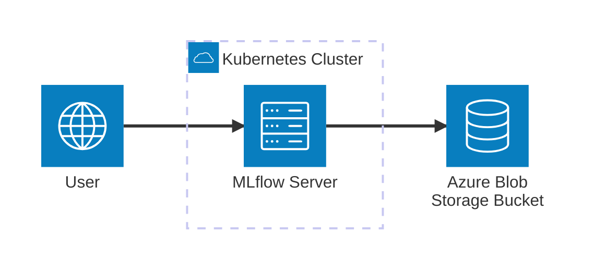
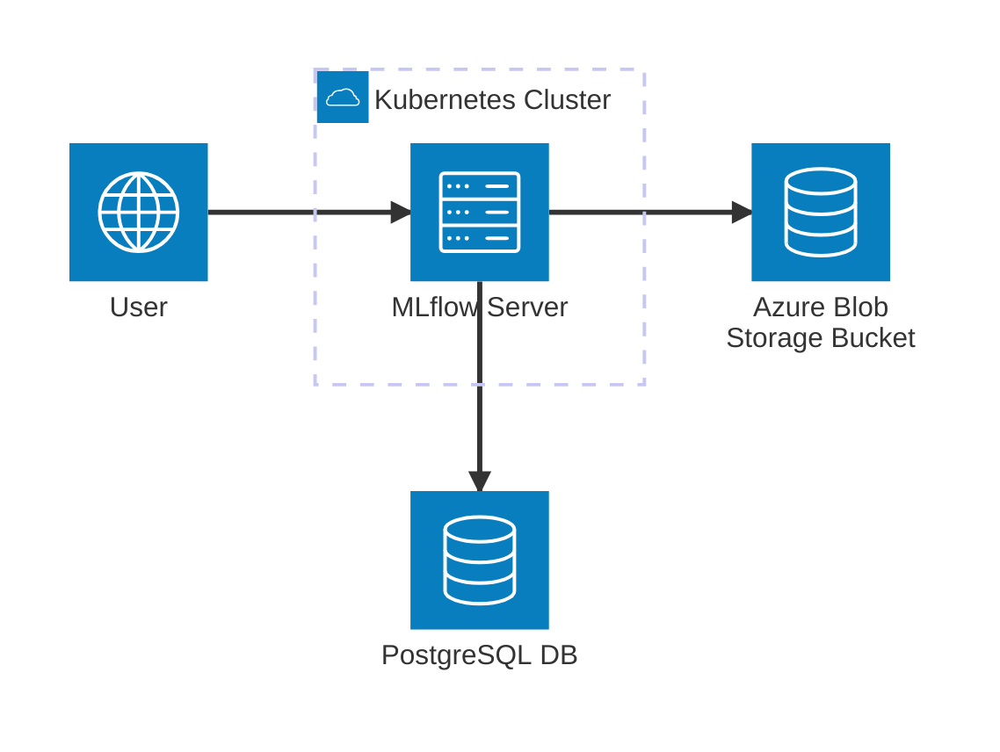

# Azure Blob Storage Integration

This guide covers configuring MLflow to use Azure Blob Storage for artifact storage. Azure Blob Storage provides scalable, durable storage for MLflow artifacts with enterprise-grade security and compliance features.



## Prerequisites

- Azure subscription with Storage Account access
- Azure CLI configured or Azure credentials available
- Kubernetes cluster with MLflow deployed
- Storage Account with Blob service enabled

## Azure Storage Account Setup

### 1. Create Storage Account

```bash
az storage account create \
  --name yourmlflowstorage \
  --resource-group your-resource-group \
  --location eastus \
  --sku Standard_LRS \
  --kind StorageV2
```

### 2. Create Blob Container

```bash
az storage container create \
  --account-name yourmlflowstorage \
  --name mlflow-artifacts
```

### 3. Get Storage Account Key

```bash
STORAGE_KEY=$(az storage account keys list \
  --account-name yourmlflowstorage \
  --resource-group your-resource-group \
  --query '[0].value' -o tsv)
```

## Authentication Options

### Option 1: Storage Account Key (Development)

```bash
kubectl create secret generic azure-storage-credentials \
  --namespace mlflow \
  --from-literal=azure-storage-account-name=yourmlflowstorage \
  --from-literal=azure-storage-account-key=$STORAGE_KEY
```

### Option 2: Service Principal (Production)

Create a service principal with Storage Blob Data Contributor role:

```bash
# Create service principal
az ad sp create-for-rbac \
  --name mlflow-storage-sp \
  --role "Storage Blob Data Contributor" \
  --scopes /subscriptions/YOUR_SUBSCRIPTION_ID/resourceGroups/YOUR_RESOURCE_GROUP/providers/Microsoft.Storage/storageAccounts/yourmlflowstorage

# Create secret with service principal credentials
kubectl create secret generic azure-service-principal \
  --namespace mlflow \
  --from-literal=azure-client-id=YOUR_CLIENT_ID \
  --from-literal=azure-client-secret=YOUR_CLIENT_SECRET \
  --from-literal=azure-tenant-id=YOUR_TENANT_ID \
  --from-literal=azure-subscription-id=YOUR_SUBSCRIPTION_ID
```

### Option 3: Managed Identity (AKS)

If using AKS with managed identity:

```bash
# Enable managed identity on AKS cluster
az aks update \
  --resource-group your-resource-group \
  --name your-aks-cluster \
  --enable-managed-identity

# Assign Storage Blob Data Contributor role to managed identity
az role assignment create \
  --assignee-object-id $(az aks show -g your-resource-group -n your-aks-cluster --query identityProfile.kubeletidentity.objectId -o tsv) \
  --role "Storage Blob Data Contributor" \
  --scope /subscriptions/YOUR_SUBSCRIPTION_ID/resourceGroups/YOUR_RESOURCE_GROUP/providers/Microsoft.Storage/storageAccounts/yourmlflowstorage
```

## MLflow Configuration

### Option 1: Using Storage Account Key



Create `values.yaml`:

```yaml
backendStore:
  databaseMigration: true
  postgres:
    enabled: true
    host: postgresql-instance1.cg034hpkmmjt.eu-central-1.rds.amazonaws.com
    port: 5432
    database: mlflow
    user: mlflowuser
    password: Pa33w0rd!

artifactRoot:
  azureBlob:
    enabled: true
    container: mlflow-artifacts
    storageAccount: yourmlflowstorage
    path: ""  # Optional: Azure blob container folder
    accessKey: ""  # Will use secret
    connectionString: ""  # Alternative to accessKey

extraEnvVars:
  AZURE_STORAGE_ACCOUNT: yourmlflowstorage
  AZURE_STORAGE_KEY: ""  # Will use secret
  MLFLOW_ARTIFACT_ROOT: "wasbs://mlflow-artifacts@yourmlflowstorage.blob.core.windows.net"
```

### Option 2: Using Service Principal

```yaml
artifactRoot:
  azureBlob:
    enabled: true
    container: mlflow-artifacts
    storageAccount: yourmlflowstorage
    path: ""

extraEnvVars:
  AZURE_CLIENT_ID: ""  # Will use secret
  AZURE_CLIENT_SECRET: ""  # Will use secret
  AZURE_TENANT_ID: ""  # Will use secret
  AZURE_SUBSCRIPTION_ID: ""  # Will use secret
  MLFLOW_ARTIFACT_ROOT: "wasbs://mlflow-artifacts@yourmlflowstorage.blob.core.windows.net"
```

### Option 3: Using Helm Set Commands

```bash
helm install mlflow community-charts/mlflow \
  --namespace mlflow \
  --set backendStore.databaseMigration=true \
  --set backendStore.postgres.enabled=true \
  --set backendStore.postgres.host=postgresql-instance1.cg034hpkmmjt.eu-central-1.rds.amazonaws.com \
  --set backendStore.postgres.database=mlflow \
  --set backendStore.postgres.user=mlflowuser \
  --set backendStore.postgres.password=Pa33w0rd! \
  --set artifactRoot.azureBlob.enabled=true \
  --set artifactRoot.azureBlob.container=mlflow-artifacts \
  --set artifactRoot.azureBlob.storageAccount=yourmlflowstorage \
  --set artifactRoot.azureBlob.accessKey=your-access-key
```

## AKS Integration with Managed Identity

If using AKS with managed identity, configure the service account:

```yaml
serviceAccount:
  create: true
  name: mlflow
  annotations:
    azure.workload.identity/client-id: $(az aks show -g your-resource-group -n your-aks-cluster --query identityProfile.kubeletidentity.clientId -o tsv)

artifactRoot:
  azureBlob:
    enabled: true
    container: mlflow-artifacts
    storageAccount: yourmlflowstorage
    path: ""
    # No credentials needed with managed identity

extraEnvVars:
  MLFLOW_ARTIFACT_ROOT: "wasbs://mlflow-artifacts@yourmlflowstorage.blob.core.windows.net"
```

## Verification

### Test Azure Storage Access

```bash
# Test from within the MLflow pod
kubectl exec -it deployment/mlflow -n mlflow -- \
  az storage blob list --container-name mlflow-artifacts --account-name yourmlflowstorage
```

### Check MLflow Logs

```bash
kubectl logs deployment/mlflow -n mlflow | grep -i "azure\|wasbs\|artifact"
```

### Test Artifact Upload

Access MLflow UI and create an experiment with artifacts to verify Azure Blob Storage integration.

## Advanced Configuration

### Custom Endpoint

For Azure Stack or custom endpoints:

```yaml
extraEnvVars:
  AZURE_STORAGE_ENDPOINT: "https://your-custom-endpoint.com"
```

### Azure Data Lake Storage Gen2

For ADLS Gen2 with hierarchical namespace:

```yaml
artifactRoot:
  azureBlob:
    enabled: true
    container: mlflow-artifacts
    storageAccount: yourmlflowstorage
    path: ""

extraEnvVars:
  MLFLOW_ARTIFACT_ROOT: "abfss://mlflow-artifacts@yourmlflowstorage.dfs.core.windows.net"
```

### Azure Storage Encryption

Enable customer-managed keys:

```bash
# Create key vault and key
az keyvault create --name your-keyvault --resource-group your-resource-group
az keyvault key create --vault-name your-keyvault --name storage-key --kty RSA --size 2048

# Configure storage account encryption
az storage account update \
  --name yourmlflowstorage \
  --resource-group your-resource-group \
  --encryption-key-source Microsoft.Keyvault \
  --encryption-key-vault https://your-keyvault.vault.azure.net/keys/storage-key
```

### Custom Azure Blob Path

Store artifacts in a specific Azure Blob folder:

```yaml
artifactRoot:
  azureBlob:
    enabled: true
    container: mlflow-artifacts
    storageAccount: yourmlflowstorage
    path: mlflow/artifacts  # Optional folder path
    accessKey: your-access-key
```

## Troubleshooting

### Common Issues

1. **Authentication Failed**: Check storage account key or service principal credentials
2. **Container Not Found**: Ensure blob container exists and is accessible
3. **Network Issues**: Check firewall rules and virtual network access
4. **Permission Denied**: Verify role assignments for service principal or managed identity
5. **Connection String Issues**: Verify connection string format and credentials

### Debug Commands

```bash
# Check Azure credentials in pod
kubectl exec -it deployment/mlflow -n mlflow -- env | grep AZURE

# Test Azure CLI connectivity
kubectl exec -it deployment/mlflow -n mlflow -- \
  az storage account show --name yourmlflowstorage

# Check MLflow Azure configuration
kubectl exec -it deployment/mlflow -n mlflow -- \
  python -c "import mlflow; print(mlflow.get_artifact_uri())"

# Test Azure Blob access
kubectl exec -it deployment/mlflow -n mlflow -- \
  az storage blob list --container-name mlflow-artifacts --account-name yourmlflowstorage
```

## Cost Optimization

- Use Azure Storage lifecycle management for cost-effective storage
- Configure blob tiering (Hot, Cool, Archive)
- Monitor storage usage with Azure Monitor
- Use Azure Storage Analytics for usage insights

## Security Best Practices

- Use managed identity instead of storage account keys when possible
- Enable Azure Storage encryption
- Configure network security with private endpoints
- Use Azure Key Vault for key management
- Regularly rotate storage account keys
- Enable soft delete for blob containers

## Monitoring and Alerting

### Storage Metrics

Enable storage analytics for monitoring:

```bash
az storage metrics update \
  --account-name yourmlflowstorage \
  --services blob \
  --hour true \
  --minute true
```

## Next Steps

- Set up [authentication](/docs/charts/mlflow/authentication-configuration) for MLflow UI
- Configure [autoscaling](/docs/charts/mlflow/autoscaling-setup) for high availability
- Set up Azure Monitor for comprehensive monitoring
- Configure backup and disaster recovery strategies
- Consider [AWS S3](/docs/charts/mlflow/aws-s3-integration) or [Google Cloud Storage](/docs/charts/mlflow/google-cloud-storage-integration) as alternatives
