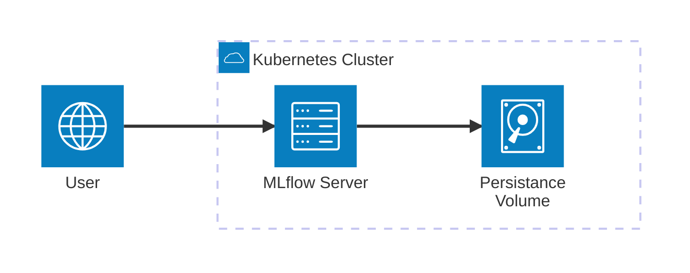

# Basic Installation with SQLite

This guide walks you through installing MLflow on Kubernetes using SQLite as the backend database. This setup is perfect for development, testing, or small-scale deployments.

:::info
**Use Case:** SQLite installation is ideal for development, testing, single-user scenarios, and learning MLflow concepts.
:::

## Prerequisites

:::warning
**Requirements:** Ensure you have all prerequisites installed and configured before proceeding with the installation.
:::

- Kubernetes cluster (v1.16+)
- Helm 3.x installed
- kubectl configured
- Storage class available for PVC

## Installation Steps

:::note
**Getting Started:** Follow these steps in order to get MLflow running quickly with minimal configuration.
:::

### 1. Add the Helm Repository

```bash
helm repo add community-charts https://community-charts.github.io/helm-charts
helm repo update
```

### 2. Create Namespace

```bash
kubectl create namespace mlflow
```

### 3. Install MLflow with Default Settings

```bash
helm install mlflow community-charts/mlflow \
  --namespace mlflow \
  --set backendStore.defaultSqlitePath=/mlflow/data/mlflow.db
```

:::tip
**Quick Start:** This command installs MLflow with SQLite backend and basic configuration suitable for development.
:::

### 4. Verify Installation

Check the deployment status:

```bash
kubectl get pods -n mlflow
```

You should see the MLflow server pod running. Wait for it to be in `Running` state.

### 5. Access MLflow UI

Port-forward to access the web interface:

```bash
kubectl port-forward svc/mlflow -n mlflow 5000:5000
```

Open your browser and navigate to `http://localhost:5000`

:::info
**Access Method:** Port-forwarding is suitable for development. For production, use ingress or load balancer.
:::

## Configuration Options

:::tip
**Customization:** Use values files to customize your MLflow installation according to your specific needs.
:::

### Basic Values Override

Create a `values.yaml` file for custom configuration:

```yaml
backendStore:
  defaultSqlitePath: /mlflow/data/mlflow.db
  databaseMigration: false  # Enable for schema updates
  databaseConnectionCheck: false  # Enable for health checks

artifactRoot:
  defaultArtifactRoot: ./mlruns
  defaultArtifactsDestination: ./mlartifacts
  proxiedArtifactStorage: false

service:
  type: ClusterIP
  port: 5000

ingress:
  enabled: false

persistence:
  enabled: true
  size: 10Gi
  storageClass: ""
```

Install with custom values:

```bash
helm install mlflow community-charts/mlflow \
  --namespace mlflow \
  -f values.yaml
```

### PVC Mount with SQLite and File-Based Artifacts



:::info
**Persistent Storage:** Using PVC ensures your MLflow data persists across pod restarts and deployments.
:::

For persistent storage with SQLite and local artifacts:

#### 1. Create PVC

```yaml
apiVersion: v1
kind: PersistentVolumeClaim
metadata:
  name: mlflow-pvc
  namespace: mlflow
spec:
  accessModes:
    - ReadWriteOnce
  resources:
    requests:
      storage: 5Gi
  storageClassName: standard
```

Apply the PVC:
```bash
kubectl apply -f mlflow-pvc.yaml
```

#### 2. Configure MLflow with PVC

```yaml
strategy:
  type: Recreate

extraVolumes:
  - name: mlflow-volume
    persistentVolumeClaim:
      claimName: mlflow-pvc

extraVolumeMounts:
  - name: mlflow-volume
    mountPath: /mlflow/data

backendStore:
  defaultSqlitePath: /mlflow/data/mlflow.db

artifactRoot:
  proxiedArtifactStorage: true
  defaultArtifactsDestination: /mlflow/data/mlartifacts

ingress:
  enabled: true
  hosts:
    - host: my-mlflow-server-domain-name.com
      paths:
        - path: /
          pathType: ImplementationSpecific
```

:::warning
**Data Persistence:** Without PVC, your MLflow data will be lost when the pod is restarted or redeployed.
:::

### Static Prefix Configuration

For serving MLflow under a specific path:

```yaml
extraArgs:
  staticPrefix: /mlflow

ingress:
  enabled: true
  hosts:
    - host: your-domain.com
      paths:
        - path: /mlflow
          pathType: ImplementationSpecific
```

### Health Probe Configuration

Configure liveness and readiness probes for better reliability:

```yaml
livenessProbe:
  initialDelaySeconds: 30
  periodSeconds: 20
  timeoutSeconds: 6
  failureThreshold: 3

readinessProbe:
  initialDelaySeconds: 30
  periodSeconds: 20
  timeoutSeconds: 6
  failureThreshold: 3
```

## Database Migration Features

### Automatic Schema Migrations

The chart supports automatic database schema migrations using init containers:

```yaml
backendStore:
  databaseMigration: true  # Enable automatic migrations
  defaultSqlitePath: /mlflow/data/mlflow.db
```

### Database Connection Health Checks

Add database availability checks before starting MLflow:

```yaml
backendStore:
  databaseConnectionCheck: true  # Enable connection checks
  defaultSqlitePath: /mlflow/data/mlflow.db
```

### Migration with PostgreSQL

When upgrading from SQLite to PostgreSQL:

```yaml
backendStore:
  databaseMigration: true
  postgres:
    enabled: true
    host: postgresql-instance.cg034hpkmmjt.eu-central-1.rds.amazonaws.com
    port: 5432
    database: mlflow
    user: mlflowuser
    password: Pa33w0rd!
```

### Migration with MySQL

When upgrading from SQLite to MySQL:

```yaml
backendStore:
  databaseMigration: true
  mysql:
    enabled: true
    host: mysql-instance.cg034hpkmmjt.eu-central-1.rds.amazonaws.com
    port: 3306
    database: mlflow
    user: mlflowuser
    password: Pa33w0rd!
```

## Advanced Configuration

### Custom Init Containers

Add custom initialization logic:

```yaml
initContainers:
  - name: custom-init
    image: busybox:1.35
    command: ['sh', '-c', 'echo "Custom initialization complete"']
```

### Environment Variables

Configure MLflow-specific environment variables:

```yaml
extraEnvVars:
  MLFLOW_TRACKING_DIR: "/mlflow/data"  # Default root directory for tracking FileStore
  MLFLOW_LOGGING_LEVEL: "INFO"  # MLflow logging level
  MLFLOW_CONFIGURE_LOGGING: "true"  # Configure MLflow logging on import
```

### Resource Limits

Set appropriate resource limits:

```yaml
resources:
  requests:
    cpu: 200m
    memory: 512Mi
  limits:
    cpu: 1000m
    memory: 2Gi
```

## Troubleshooting

### Check Pod Logs

```bash
kubectl logs -f deployment/mlflow -n mlflow
```

### Check PVC Status

```bash
kubectl get pvc -n mlflow
```

### Check Init Container Logs

```bash
kubectl logs deployment/mlflow -c init-mlflow -n mlflow
```

### Common Issues

1. **Pod stuck in Pending**: Check if storage class is available
2. **Database migration errors**: Verify database permissions and connectivity
3. **Permission issues**: Check security context settings
4. **Init container failures**: Review init container logs for migration issues

### Debug Commands

```bash
# Check database file
kubectl exec -it deployment/mlflow -n mlflow -- ls -la /mlflow/data/

# Test SQLite database
kubectl exec -it deployment/mlflow -n mlflow -- \
  sqlite3 /mlflow/data/mlflow.db ".tables"

# Check MLflow configuration
kubectl exec -it deployment/mlflow -n mlflow -- \
  python -c "import mlflow; print(mlflow.get_tracking_uri())"
```

## Migration Paths

### From In-Memory SQLite to File-Based

```yaml
backendStore:
  defaultSqlitePath: /mlflow/data/mlflow.db  # Change from :memory:
```

### From SQLite to PostgreSQL

```yaml
backendStore:
  databaseMigration: true
  postgres:
    enabled: true
    host: your-postgres-host
    database: mlflow
    user: mlflowuser
    password: your-password
```

### From SQLite to MySQL

```yaml
backendStore:
  databaseMigration: true
  mysql:
    enabled: true
    host: your-mysql-host
    database: mlflow
    user: mlflowuser
    password: your-password
```

## Next Steps

- For production use, consider [PostgreSQL backend](/docs/charts/mlflow/postgresql-backend-installation)
- Set up [authentication](/docs/charts/mlflow/authentication-configuration)
- Configure [AWS S3](/docs/charts/mlflow/aws-s3-integration) or [Azure Blob Storage](/docs/charts/mlflow/azure-blob-storage-integration) for artifacts
- Enable [autoscaling](/docs/charts/mlflow/autoscaling-setup) for high availability
