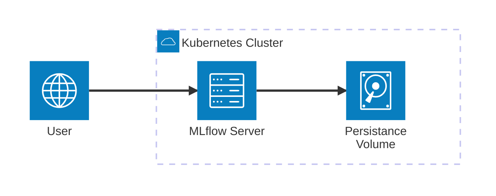

# Basic Installation with SQLite

This guide walks you through installing MLflow on Kubernetes using SQLite as the backend database. This setup is perfect for development, testing, or small-scale deployments.

:::info
**Use Case:** SQLite installation is ideal for development, testing, single-user scenarios, and learning MLflow concepts.
:::

:::warning
**Production Limitation:** SQLite is not suitable for production environments with multiple users or high data volumes. Use PostgreSQL or MySQL for production deployments.
:::

## Prerequisites

:::warning
**Requirements:** Ensure you have all prerequisites installed and configured before proceeding with the installation.
:::

- Kubernetes cluster (v1.16+)
- Helm 3.x installed
- kubectl configured
- Storage class available for PVC

:::danger
**Cluster Compatibility:** Verify your Kubernetes cluster version meets the minimum requirements to avoid deployment issues.
:::

## Installation Steps

:::note
**Getting Started:** Follow these steps in order to get MLflow running quickly with minimal configuration.
:::

### 1. Add the Helm Repository

```bash
helm repo add community-charts https://community-charts.github.io/helm-charts
helm repo update
```

:::tip
**Repository Management:** Always update the repository before installing to get the latest chart versions and bug fixes.
:::

### 2. Create Namespace

```bash
kubectl create namespace mlflow
```

:::info
**Namespace Organization:** Using dedicated namespaces helps organize your Kubernetes resources and simplifies management.
:::

### 3. Install MLflow with Default Settings

```bash
helm install mlflow community-charts/mlflow \
  --namespace mlflow \
  --set backendStore.defaultSqlitePath=/mlflow/data/mlflow.db
```

:::tip
**Quick Start:** This command installs MLflow with SQLite backend and basic configuration suitable for development.
:::

:::warning
**Data Persistence:** The default installation stores SQLite data in the pod. Data will be lost if the pod is deleted.
:::

### 4. Verify Installation

Check the deployment status:

```bash
kubectl get pods -n mlflow
```

You should see the MLflow server pod running. Wait for it to be in `Running` state.

:::tip
**Status Monitoring:** Use `kubectl describe pod` to troubleshoot if the pod doesn't reach Running state.
:::

### 5. Access MLflow UI

Port-forward to access the web interface:

```bash
kubectl port-forward svc/mlflow -n mlflow 5000:5000
```

Open your browser and navigate to `http://localhost:5000`

:::info
**Access Method:** Port-forwarding is suitable for development. For production, use ingress or load balancer.
:::

:::warning
**Security Note:** Port-forwarding bypasses ingress security. Use proper ingress configuration for production access.
:::

## Configuration Options

:::tip
**Customization:** Use values files to customize your MLflow installation according to your specific needs.
:::

### Basic Values Override

Create a `values.yaml` file for custom configuration:

```yaml
backendStore:
  defaultSqlitePath: /mlflow/data/mlflow.db
  databaseMigration: false  # Enable for schema updates
  databaseConnectionCheck: false  # Enable for health checks

artifactRoot:
  defaultArtifactRoot: ./mlruns
  defaultArtifactsDestination: ./mlartifacts
  proxiedArtifactStorage: false

service:
  type: ClusterIP
  port: 5000

ingress:
  enabled: false

persistence:
  enabled: true
  size: 10Gi
  storageClass: ""
```

Install with custom values:

```bash
helm install mlflow community-charts/mlflow \
  --namespace mlflow \
  -f values.yaml
```

:::info
**Values File:** Using a values file makes it easier to manage and version your configuration.
:::

### PVC Mount with SQLite and File-Based Artifacts



:::info
**Persistent Storage:** Using PVC ensures your MLflow data persists across pod restarts and deployments.
:::

For persistent storage with SQLite and local artifacts:

#### 1. Create PVC

```yaml
apiVersion: v1
kind: PersistentVolumeClaim
metadata:
  name: mlflow-pvc
  namespace: mlflow
spec:
  accessModes:
    - ReadWriteOnce
  resources:
    requests:
      storage: 5Gi
  storageClassName: standard
```

Apply the PVC:
```bash
kubectl apply -f mlflow-pvc.yaml
```

:::tip
**Storage Planning:** Choose an appropriate storage size based on your expected data volume and retention requirements.
:::

#### 2. Configure MLflow with PVC

```yaml
strategy:
  type: Recreate

extraVolumes:
  - name: mlflow-volume
    persistentVolumeClaim:
      claimName: mlflow-pvc

extraVolumeMounts:
  - name: mlflow-volume
    mountPath: /mlflow/data

backendStore:
  defaultSqlitePath: /mlflow/data/mlflow.db

artifactRoot:
  proxiedArtifactStorage: true
  defaultArtifactsDestination: /mlflow/data/mlartifacts

ingress:
  enabled: true
  hosts:
    - host: my-mlflow-server-domain-name.com
      paths:
        - path: /
          pathType: ImplementationSpecific
```

:::warning
**Data Persistence:** Without PVC, your MLflow data will be lost when the pod is restarted or redeployed.
**SQLite Limitations:** While this setup works, consider PostgreSQL for production environments with multiple users or high data volumes.
:::

:::danger
**Data Backup:** Always implement regular backups for your MLflow data, especially when using SQLite in any environment.
:::

## Advanced Configuration

:::info
**Advanced Features:** These configurations provide additional functionality for more complex deployment scenarios.
:::

### Database Migrations

Enable automatic database schema migrations:

```yaml
backendStore:
  databaseMigration: true
  databaseConnectionCheck: true
```

:::warning
**Migration Safety:** Database migrations are disabled by default. Enable them only when you're ready to update your database schema.
:::

:::tip
**Migration Testing:** Test migrations in a staging environment before applying to production.
:::

### Authentication Setup

Enable basic authentication:

```yaml
auth:
  enabled: true
  adminUsername: admin
  adminPassword: your-secure-password
```

:::danger
**Security Requirement:** Always enable authentication in production environments to secure your MLflow instance.
:::

:::warning
**Password Security:** Use strong, unique passwords and consider using Kubernetes secrets for credential management.
:::

### Resource Management

Configure resource limits and requests:

```yaml
resources:
  requests:
    cpu: 100m
    memory: 128Mi
  limits:
    cpu: 500m
    memory: 512Mi
```

:::tip
**Resource Planning:** Start with conservative limits and adjust based on actual usage patterns.
:::

### Health Checks

Configure liveness and readiness probes:

```yaml
livenessProbe:
  httpGet:
    path: /health
    port: 5000
  initialDelaySeconds: 30
  periodSeconds: 10
  timeoutSeconds: 5
  failureThreshold: 3

readinessProbe:
  httpGet:
    path: /health
    port: 5000
  initialDelaySeconds: 5
  periodSeconds: 5
  timeoutSeconds: 3
  failureThreshold: 3
```

:::info
**Health Monitoring:** Health checks help Kubernetes detect and recover from application failures automatically.
:::

## Troubleshooting

:::info
**Common Issues:** This section covers the most frequently encountered problems and their solutions.
:::

### Pod Not Starting

Check pod status and logs:

```bash
kubectl get pods -n mlflow
kubectl describe pod <pod-name> -n mlflow
kubectl logs <pod-name> -n mlflow
```

:::tip
**Debug Commands:** Use these commands to diagnose pod startup issues.
:::

### Database Connection Issues

For SQLite-specific issues:

```bash
# Check if SQLite file exists
kubectl exec -it <pod-name> -n mlflow -- ls -la /mlflow/data/

# Check SQLite file permissions
kubectl exec -it <pod-name> -n mlflow -- ls -la /mlflow/data/mlflow.db
```

:::warning
**Permission Issues:** Ensure the MLflow container has proper permissions to read/write the SQLite database file.
:::

### Storage Issues

Check PVC status:

```bash
kubectl get pvc -n mlflow
kubectl describe pvc mlflow-pvc -n mlflow
```

:::tip
**Storage Troubleshooting:** Verify PVC is bound and has sufficient storage capacity.
:::

### Access Issues

Check service and port-forward:

```bash
kubectl get svc -n mlflow
kubectl port-forward svc/mlflow -n mlflow 5000:5000
```

:::info
**Network Debugging:** Verify the service is properly configured and port-forwarding is working.
:::

## Performance Considerations

:::tip
**Performance Tips:** These recommendations help optimize MLflow performance for your specific use case.
:::

### SQLite Performance

- **File System**: Use SSD storage for better I/O performance
- **Concurrent Access**: SQLite has limitations with concurrent writes
- **File Size**: Monitor database file size and implement cleanup strategies

:::warning
**Concurrency Limits:** SQLite is not suitable for high-concurrency environments. Consider PostgreSQL for multi-user scenarios.
:::

### Resource Optimization

- **Memory**: Allocate sufficient memory for MLflow operations
- **CPU**: Monitor CPU usage and adjust limits accordingly
- **Storage**: Use fast storage for better database performance

:::info
**Resource Monitoring:** Use Kubernetes metrics to monitor resource usage and optimize allocation.
:::

## Security Considerations

:::warning
**Security Best Practices:** Implement these security measures to protect your MLflow deployment.
:::

### Network Security

- Use ingress with TLS for external access
- Configure network policies to restrict pod-to-pod communication
- Use service mesh for advanced traffic management

### Data Security

- Enable authentication for all production deployments
- Use Kubernetes secrets for sensitive configuration
- Implement regular backups for data protection

:::danger
**Production Security:** Never deploy MLflow without authentication in production environments.
:::

## Next Steps

:::tip
**Getting Started:** Follow these guides to enhance your MLflow deployment.
:::

- For production use, consider [PostgreSQL backend](/docs/charts/mlflow/postgresql-backend-installation)
- Set up [authentication](/docs/charts/mlflow/authentication-configuration)
- Configure [AWS S3](/docs/charts/mlflow/aws-s3-integration) or [Azure Blob Storage](/docs/charts/mlflow/azure-blob-storage-integration) for artifacts
- Enable [autoscaling](/docs/charts/mlflow/autoscaling-setup) for high availability

:::info
**Production Migration:** Consider migrating to PostgreSQL when you need production-grade features or multi-user support.
:::