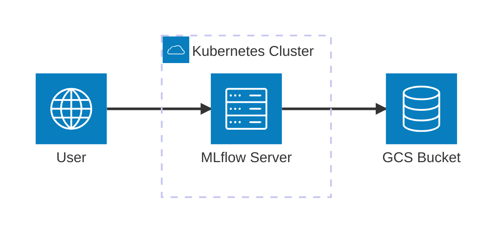
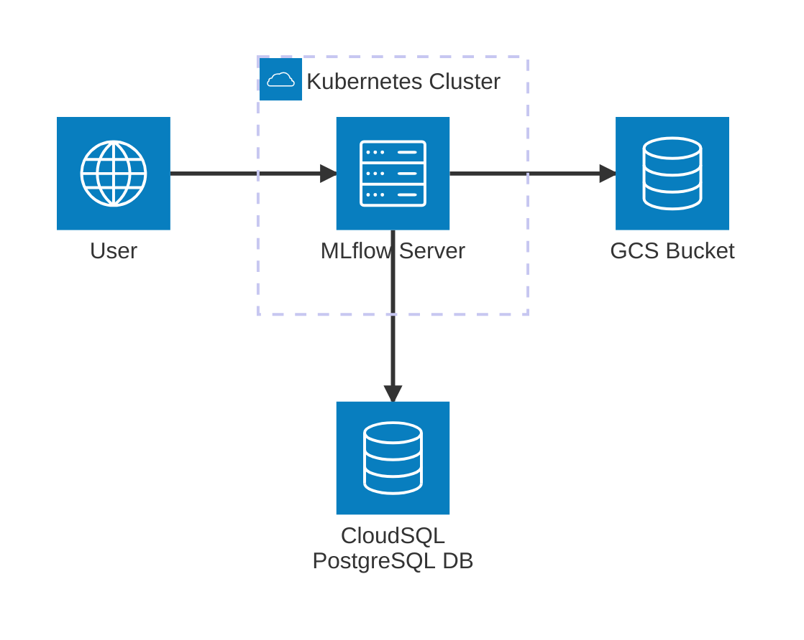

# Google Cloud Storage Integration

This guide covers configuring MLflow to use Google Cloud Storage (GCS) for artifact storage. GCS provides scalable, durable storage for MLflow artifacts with enterprise-grade security and global availability.



## Prerequisites

- Google Cloud Platform account with GCS access
- Google Cloud CLI configured or service account credentials available
- Kubernetes cluster with MLflow deployed
- GCS bucket created and accessible

## GCS Bucket Setup

### 1. Create GCS Bucket

```bash
gsutil mb gs://your-mlflow-artifacts-bucket
```

### 2. Configure Bucket Versioning (Recommended)

```bash
gsutil versioning set on gs://your-mlflow-artifacts-bucket
```

### 3. Configure Bucket Lifecycle (Optional)

```bash
gsutil lifecycle set lifecycle.json gs://your-mlflow-artifacts-bucket
```

Create `lifecycle.json`:
```json
{
  "rule": [
    {
      "action": {"type": "Delete"},
      "condition": {
        "age": 365,
        "isLive": true
      }
    }
  ]
}
```

## Authentication Options

### Option 1: Service Account Key (Development)

Create a service account with Storage Object Admin role:

```bash
# Create service account
gcloud iam service-accounts create mlflow-gcs-sa \
  --display-name="MLflow GCS Service Account"

# Grant Storage Object Admin role
gcloud projects add-iam-policy-binding YOUR_PROJECT_ID \
  --member="serviceAccount:mlflow-gcs-sa@YOUR_PROJECT_ID.iam.gserviceaccount.com" \
  --role="roles/storage.objectAdmin"

# Create and download key
gcloud iam service-accounts keys create mlflow-gcs-key.json \
  --iam-account=mlflow-gcs-sa@YOUR_PROJECT_ID.iam.gserviceaccount.com
```

### Option 2: Workload Identity (GKE Production)

If using GKE with Workload Identity:

```bash
# Enable Workload Identity
gcloud container clusters update your-cluster \
  --workload-pool=YOUR_PROJECT_ID.svc.id.goog \
  --zone=your-zone

# Create service account
gcloud iam service-accounts create mlflow-gcs-sa \
  --display-name="MLflow GCS Service Account"

# Grant Storage Object Admin role
gcloud projects add-iam-policy-binding YOUR_PROJECT_ID \
  --member="serviceAccount:mlflow-gcs-sa@YOUR_PROJECT_ID.iam.gserviceaccount.com" \
  --role="roles/storage.objectAdmin"

# Bind service account to Kubernetes service account
gcloud iam service-accounts add-iam-policy-binding \
  mlflow-gcs-sa@YOUR_PROJECT_ID.iam.gserviceaccount.com \
  --role="roles/iam.workloadIdentityUser" \
  --member="serviceAccount:YOUR_PROJECT_ID.svc.id.goog[mlflow/mlflow]"
```

## Kubernetes Secret for GCS Credentials

### Create Secret with Service Account Key

```bash
kubectl create secret generic gcs-credentials \
  --namespace mlflow \
  --from-file=key.json=mlflow-gcs-key.json
```

## MLflow Configuration



### Option 1: Using Service Account Key

Create `values.yaml`:

```yaml
backendStore:
  databaseMigration: true
  databaseConnectionCheck: true
  postgres:
    enabled: true
    host: postgresql-instance1.cg034hpkmmjt.eu-central-1.rds.amazonaws.com
    port: 5432
    database: mlflow
    user: mlflowuser
    password: Pa33w0rd!

artifactRoot:
  gcs:
    enabled: true
    bucket: your-mlflow-artifacts-bucket
    path: ""  # Optional: GCS bucket folder

extraEnvVars:
  GOOGLE_APPLICATION_CREDENTIALS: /etc/gcs/key.json
  MLFLOW_GCS_DEFAULT_TIMEOUT: "60"
  MLFLOW_GCS_UPLOAD_CHUNK_SIZE: "104857600"
  MLFLOW_GCS_DOWNLOAD_CHUNK_SIZE: "104857600"

extraVolumes:
  - name: gcs-credentials
    secret:
      secretName: gcs-credentials

extraVolumeMounts:
  - name: gcs-credentials
    mountPath: /etc/gcs
    readOnly: true
```

### Option 2: Using Workload Identity

```yaml
serviceAccount:
  create: true
  annotations:
    iam.gke.io/gcp-service-account: mlflow-gcs-sa@YOUR_PROJECT_ID.iam.gserviceaccount.com
  name: mlflow

backendStore:
  databaseMigration: true
  databaseConnectionCheck: true
  postgres:
    enabled: true
    host: postgresql-instance1.cg034hpkmmjt.eu-central-1.rds.amazonaws.com
    port: 5432
    database: mlflow
    user: mlflowuser
    password: Pa33w0rd!

artifactRoot:
  gcs:
    enabled: true
    bucket: your-mlflow-artifacts-bucket
    path: ""
    # No credentials needed with Workload Identity
```

### Option 3: Using Helm Set Commands

```bash
helm install mlflow community-charts/mlflow \
  --namespace mlflow \
  --set backendStore.databaseMigration=true \
  --set backendStore.postgres.enabled=true \
  --set backendStore.postgres.host=postgresql-instance1.cg034hpkmmjt.eu-central-1.rds.amazonaws.com \
  --set backendStore.postgres.database=mlflow \
  --set backendStore.postgres.user=mlflowuser \
  --set backendStore.postgres.password=Pa33w0rd! \
  --set artifactRoot.gcs.enabled=true \
  --set artifactRoot.gcs.bucket=your-mlflow-artifacts-bucket
```

## Verification

### Test GCS Access

```bash
# Test from within the MLflow pod
kubectl exec -it deployment/mlflow -n mlflow -- \
  gsutil ls gs://your-mlflow-artifacts-bucket
```

### Check MLflow Logs

```bash
kubectl logs deployment/mlflow -n mlflow | grep -i "gcs\|artifact"
```

### Test Artifact Upload

Access MLflow UI and create an experiment with artifacts to verify GCS integration.

## Advanced Configuration

### Custom GCS Endpoint

For GCS-compatible storage or custom endpoints:

```yaml
extraEnvVars:
  STORAGE_EMULATOR_HOST: http://your-custom-gcs-endpoint:4443
```

### GCS Performance Optimization

Configure chunk sizes and timeouts for better performance:

```yaml
extraEnvVars:
  MLFLOW_GCS_DEFAULT_TIMEOUT: "120"  # 2 minutes
  MLFLOW_GCS_UPLOAD_CHUNK_SIZE: "209715200"  # 200MB
  MLFLOW_GCS_DOWNLOAD_CHUNK_SIZE: "209715200"  # 200MB
```

### Custom GCS Path

Store artifacts in a specific GCS folder:

```yaml
artifactRoot:
  gcs:
    enabled: true
    bucket: your-mlflow-artifacts-bucket
    path: mlflow/artifacts  # Optional folder path
```

### GCS Encryption

Enable customer-managed encryption keys:

```bash
# Create encryption key
gcloud kms keys create mlflow-key \
  --keyring mlflow-keyring \
  --location global \
  --purpose encryption

# Configure bucket encryption
gsutil kms encryption -k projects/YOUR_PROJECT_ID/locations/global/keyRings/mlflow-keyring/cryptoKeys/mlflow-key gs://your-mlflow-artifacts-bucket
```

## Troubleshooting

### Common Issues

1. **Authentication Failed**: Check service account permissions and credentials
2. **Bucket Not Found**: Ensure bucket exists and is accessible
3. **Network Issues**: Check firewall rules and VPC access
4. **Permission Denied**: Verify IAM roles and service account configuration
5. **Timeout Issues**: Adjust timeout values for large artifacts

### Debug Commands

```bash
# Check GCS credentials in pod
kubectl exec -it deployment/mlflow -n mlflow -- env | grep GOOGLE

# Test GCS connectivity
kubectl exec -it deployment/mlflow -n mlflow -- \
  gsutil ls gs://your-mlflow-artifacts-bucket

# Check MLflow GCS configuration
kubectl exec -it deployment/mlflow -n mlflow -- \
  python -c "import mlflow; print(mlflow.get_artifact_uri())"

# Test service account authentication
kubectl exec -it deployment/mlflow -n mlflow -- \
  gcloud auth list
```

## Cost Optimization

- Use GCS lifecycle management for cost-effective storage
- Configure object lifecycle policies to move old artifacts to cheaper storage classes
- Monitor GCS usage with Cloud Monitoring
- Use GCS Transfer Service for large data migrations

## Security Best Practices

- Use Workload Identity instead of service account keys when possible
- Enable GCS bucket encryption
- Configure IAM policies with least privilege access
- Use VPC Service Controls for network security
- Regularly rotate service account keys
- Enable audit logging for GCS operations

## Monitoring and Alerting

### Cloud Monitoring Integration

```yaml
extraEnvVars:
  GOOGLE_CLOUD_PROJECT: your-project-id
  GOOGLE_APPLICATION_CREDENTIALS: /etc/gcs/key.json
```

### GCS Metrics

Enable monitoring for GCS operations:

```bash
# Enable GCS monitoring
gcloud services enable storage-component.googleapis.com

# Create monitoring dashboard
gcloud monitoring dashboards create --config-from-file=dashboard.json
```

## Production Configuration Example

```yaml
backendStore:
  databaseMigration: true
  databaseConnectionCheck: true
  postgres:
    enabled: true
    host: postgresql-instance1.cg034hpkmmjt.eu-central-1.rds.amazonaws.com
    port: 5432
    database: mlflow
    user: mlflowuser
    password: Pa33w0rd!

artifactRoot:
  gcs:
    enabled: true
    bucket: your-mlflow-artifacts-bucket
    path: ""

serviceAccount:
  create: true
  annotations:
    iam.gke.io/gcp-service-account: mlflow-gcs-sa@YOUR_PROJECT_ID.iam.gserviceaccount.com
  name: mlflow

serviceMonitor:
  enabled: true
  namespace: monitoring
  interval: 30s
  telemetryPath: /metrics
  labels:
    release: prometheus
  timeout: 10s
  targetLabels: []

resources:
  requests:
    cpu: 500m
    memory: 1Gi
  limits:
    cpu: 2
    memory: 4Gi

ingress:
  enabled: true
  className: nginx
  hosts:
    - host: mlflow.your-domain.com
      paths:
        - path: /
          pathType: Prefix
  tls:
    - secretName: mlflow-tls
      hosts:
        - mlflow.your-domain.com
```

## Next Steps

- Set up [authentication](/docs/charts/mlflow/authentication-configuration) for MLflow UI
- Configure [autoscaling](/docs/charts/mlflow/autoscaling-setup) for high availability
- Set up monitoring and alerting for GCS usage
- Configure backup and disaster recovery strategies
- Consider [AWS S3](/docs/charts/mlflow/aws-s3-integration) or [Azure Blob Storage](/docs/charts/mlflow/azure-blob-storage-integration) as alternatives

### Custom Environment Variables

```yaml
extraEnvVars:
  # GCS Configuration
  MLFLOW_GCS_DEFAULT_TIMEOUT: "60"  # GCS transfer timeout in seconds
  MLFLOW_GCS_UPLOAD_CHUNK_SIZE: "104857600"  # GCS upload chunk size (100MB)
  MLFLOW_GCS_DOWNLOAD_CHUNK_SIZE: "104857600"  # GCS download chunk size (100MB)
  
  # Artifact Configuration
  MLFLOW_ARTIFACT_UPLOAD_DOWNLOAD_TIMEOUT: "300"  # Artifact transfer timeout
  MLFLOW_ENABLE_ARTIFACTS_PROGRESS_BAR: "true"  # Show progress bar for artifacts
  MLFLOW_ENABLE_MULTIPART_UPLOAD: "true"  # Enable multipart upload for large files
  MLFLOW_ENABLE_MULTIPART_DOWNLOAD: "true"  # Enable multipart download for large files
  
  # HTTP Configuration
  MLFLOW_HTTP_REQUEST_TIMEOUT: "120"  # HTTP request timeout in seconds
  MLFLOW_HTTP_REQUEST_MAX_RETRIES: "7"  # Maximum HTTP retries
```
