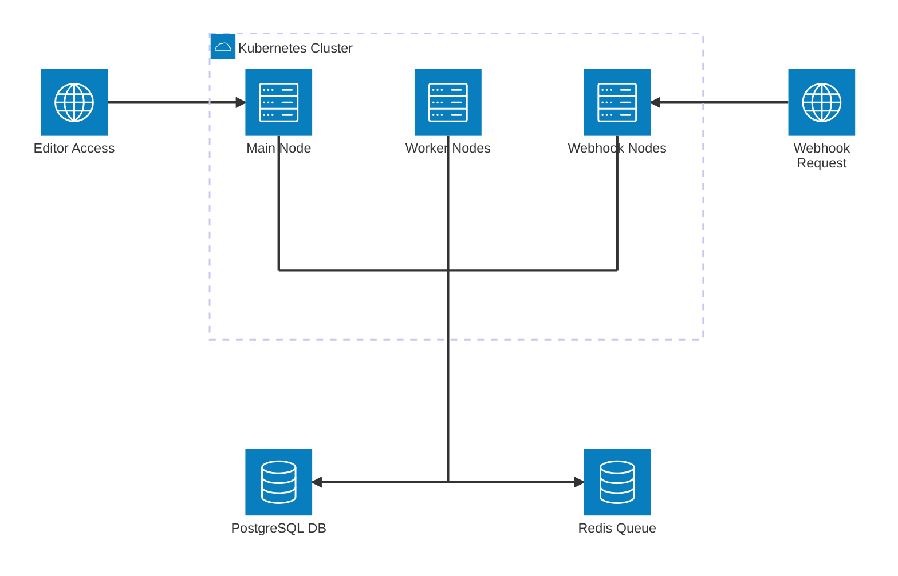

# n8n Queue Mode Setup

Queue mode enables distributed execution in n8n by separating the main node (UI/API) from worker nodes (execution) and webhook nodes (webhook processing). This architecture provides better scalability, reliability, and performance for production workloads.

:::tip
**Production Architecture:** Queue mode is the recommended architecture for production deployments. It provides better scalability, reliability, and performance compared to single-node deployments.
:::

## Architecture Overview

:::info
**Distributed Execution:** Queue mode separates concerns by dedicating specific nodes to different tasks, improving overall system performance and reliability.
:::

### Queue Mode Components



### Component Roles

- **Main Node**: Handles UI, API requests, workflow management
- **Worker Nodes**: Execute workflows and process tasks
- **Webhook Nodes**: Process incoming webhook requests
- **Redis**: Message broker for communication between nodes

## Prerequisites

:::warning
**Requirements:** Queue mode requires PostgreSQL and Redis. SQLite is not supported for queue mode deployments.
:::

### Required Components

1. **PostgreSQL Database** (required for queue mode)
2. **Redis Instance** (message broker)
3. **Kubernetes Cluster** with sufficient resources
4. **Storage Class** for persistent volumes

### Resource Requirements

- **Main Node**: 100m CPU, 128Mi memory minimum
- **Worker Nodes**: 500m CPU, 512Mi memory minimum per node
- **Webhook Nodes**: 100m CPU, 128Mi memory minimum per node
- **Redis**: 100m CPU, 128Mi memory minimum

## Basic Queue Mode Setup

:::note
**Getting Started:** Start with a basic queue mode setup and scale up as needed based on your workload requirements.
:::

### 1. Enable PostgreSQL

```yaml
db:
  type: postgresdb

postgresql:
  enabled: true
  auth:
    username: n8n
    password: your-secure-password
    database: n8n
  primary:
    persistence:
      enabled: true
      size: 10Gi
```

### 2. Enable Redis

```yaml
redis:
  enabled: true
  architecture: standalone
  master:
    persistence:
      enabled: true
      size: 5Gi
```

### 3. Configure Worker Nodes

```yaml
worker:
  mode: queue
  count: 2
  concurrency: 10
  resources:
    requests:
      cpu: 500m
      memory: 512Mi
    limits:
      cpu: 2000m
      memory: 2Gi
```

### 4. Configure Webhook Nodes

```yaml
webhook:
  mode: queue
  url: "https://webhook.yourdomain.com"
  count: 2
  resources:
    requests:
      cpu: 100m
      memory: 128Mi
    limits:
      cpu: 512m
      memory: 512Mi
```

### 5. Complete Basic Configuration

```yaml
# Basic queue mode setup
db:
  type: postgresdb

postgresql:
  enabled: true
  auth:
    username: n8n
    password: your-secure-password
    database: n8n
  primary:
    persistence:
      enabled: true
      size: 10Gi

redis:
  enabled: true
  architecture: standalone
  master:
    persistence:
      enabled: true
      size: 5Gi

worker:
  mode: queue
  count: 2
  concurrency: 10
  resources:
    requests:
      cpu: 500m
      memory: 512Mi
    limits:
      cpu: 2000m
      memory: 2Gi

webhook:
  mode: queue
  url: "https://webhook.yourdomain.com"
  count: 2
  resources:
    requests:
      cpu: 100m
      memory: 128Mi
    limits:
      cpu: 512m
      memory: 512Mi

ingress:
  enabled: true
  hosts:
    - host: n8n.yourdomain.com
      paths:
        - path: /
          pathType: Prefix
```

## Advanced Queue Mode Configuration

:::tip
**Scaling Strategy:** Use autoscaling for dynamic workloads and manual scaling for predictable, steady-state workloads.
:::

### Autoscaling Workers

```yaml
worker:
  mode: queue
  autoscaling:
    enabled: true
    minReplicas: 2
    maxReplicas: 10
    metrics:
      - type: Resource
        resource:
          name: cpu
          target:
            type: Utilization
            averageUtilization: 80
      - type: Resource
        resource:
          name: memory
          target:
            type: Utilization
            averageUtilization: 80
    behavior:
      scaleDown:
        stabilizationWindowSeconds: 300
        policies:
        - type: Percent
          value: 100
          periodSeconds: 15
      scaleUp:
        stabilizationWindowSeconds: 0
        policies:
        - type: Percent
          value: 100
          periodSeconds: 15
        - type: Pods
          value: 4
          periodSeconds: 15
        selectPolicy: Max
```

### Autoscaling Webhooks

```yaml
webhook:
  mode: queue
  url: "https://webhook.yourdomain.com"
  autoscaling:
    enabled: true
    minReplicas: 2
    maxReplicas: 10
    metrics:
      - type: Resource
        resource:
          name: cpu
          target:
            type: Utilization
            averageUtilization: 80
      - type: Pods
        pods:
          metric:
            name: packets-per-second
          target:
            type: AverageValue
            averageValue: 1k
```

### Deploy on All Nodes

```yaml
worker:
  mode: queue
  allNodes: true  # Deploy one worker per node
  autoscaling:
    enabled: false  # Disable autoscaling when using allNodes

webhook:
  mode: queue
  url: "https://webhook.yourdomain.com"
  allNodes: true  # Deploy one webhook per node
  autoscaling:
    enabled: false
```

### External Redis Configuration

```yaml
# Disable built-in Redis
redis:
  enabled: false

# Configure external Redis
externalRedis:
  host: your-redis-host.com
  port: 6379
  username: default
  password: your-redis-password
  existingSecret: redis-secret  # Use Kubernetes secret
```

### High Availability Redis

```yaml
redis:
  enabled: true
  architecture: replication  # Master-slave replication

  master:
    persistence:
      enabled: true
      size: 10Gi
    resources:
      requests:
        cpu: 100m
        memory: 256Mi
      limits:
        cpu: 500m
        memory: 512Mi

  replica:
    replicaCount: 2
    persistence:
      enabled: true
      size: 10Gi
    resources:
      requests:
        cpu: 100m
        memory: 256Mi
      limits:
        cpu: 500m
        memory: 512Mi
```

## Production Queue Mode Examples

### Small Production Setup

```yaml
# Small production (2-5 users)
db:
  type: postgresdb

postgresql:
  enabled: true
  auth:
    username: n8n
    password: your-secure-password
    database: n8n
  primary:
    persistence:
      enabled: true
      size: 20Gi

redis:
  enabled: true
  architecture: standalone
  master:
    persistence:
      enabled: true
      size: 10Gi

worker:
  mode: queue
  count: 3
  concurrency: 10
  resources:
    requests:
      cpu: 500m
      memory: 512Mi
    limits:
      cpu: 2000m
      memory: 2Gi

webhook:
  mode: queue
  url: "https://webhook.yourdomain.com"
  count: 2
  resources:
    requests:
      cpu: 100m
      memory: 128Mi
    limits:
      cpu: 512m
      memory: 512Mi

ingress:
  enabled: true
  hosts:
    - host: n8n.yourdomain.com
      paths:
        - path: /
          pathType: Prefix
```

### Medium Production Setup

```yaml
# Medium production (5-20 users)
db:
  type: postgresdb

postgresql:
  enabled: true
  auth:
    username: n8n
    password: your-secure-password
    database: n8n
  primary:
    persistence:
      enabled: true
      size: 50Gi
    resources:
      requests:
        cpu: 500m
        memory: 1Gi
      limits:
        cpu: 2000m
        memory: 4Gi

redis:
  enabled: true
  architecture: replication
  master:
    persistence:
      enabled: true
      size: 20Gi
    resources:
      requests:
        cpu: 200m
        memory: 512Mi
      limits:
        cpu: 1000m
        memory: 1Gi
  replica:
    replicaCount: 2
    persistence:
      enabled: true
      size: 20Gi

worker:
  mode: queue
  autoscaling:
    enabled: true
    minReplicas: 3
    maxReplicas: 15
    metrics:
      - type: Resource
        resource:
          name: cpu
          target:
            type: Utilization
            averageUtilization: 80
      - type: Resource
        resource:
          name: memory
          target:
            type: Utilization
            averageUtilization: 80
  resources:
    requests:
      cpu: 1000m
      memory: 1Gi
    limits:
      cpu: 4000m
      memory: 4Gi

webhook:
  mode: queue
  url: "https://webhook.yourdomain.com"
  autoscaling:
    enabled: true
    minReplicas: 3
    maxReplicas: 10
  resources:
    requests:
      cpu: 200m
      memory: 256Mi
    limits:
      cpu: 1000m
      memory: 1Gi

ingress:
  enabled: true
  hosts:
    - host: n8n.yourdomain.com
      paths:
        - path: /
          pathType: Prefix
```

### Large Production Setup

```yaml
# Large production (20+ users)
db:
  type: postgresdb

externalPostgresql:
  host: your-postgres-host.com
  port: 5432
  username: n8n
  password: your-secure-password
  database: n8n
  existingSecret: postgres-secret

externalRedis:
  host: your-redis-host.com
  port: 6379
  password: your-redis-password
  existingSecret: redis-secret

worker:
  mode: queue
  autoscaling:
    enabled: true
    minReplicas: 5
    maxReplicas: 50
    metrics:
      - type: Resource
        resource:
          name: cpu
          target:
            type: Utilization
            averageUtilization: 70
      - type: Resource
        resource:
          name: memory
          target:
            type: Utilization
            averageUtilization: 70
      - type: Pods
        pods:
          metric:
            name: executions-per-second
          target:
            type: AverageValue
            averageValue: 100
  resources:
    requests:
      cpu: 2000m
      memory: 2Gi
    limits:
      cpu: 8000m
      memory: 8Gi

webhook:
  mode: queue
  url: "https://webhook.yourdomain.com"
  autoscaling:
    enabled: true
    minReplicas: 5
    maxReplicas: 20
  resources:
    requests:
      cpu: 500m
      memory: 512Mi
    limits:
      cpu: 2000m
      memory: 2Gi

ingress:
  enabled: true
  hosts:
    - host: n8n.yourdomain.com
      paths:
        - path: /
          pathType: Prefix
```

## Monitoring and Observability

### ServiceMonitor Configuration

```yaml
serviceMonitor:
  enabled: true
  interval: 30s
  timeout: 10s
  labels:
    release: prometheus
  include:
    defaultMetrics: true
    cacheMetrics: true
    messageEventBusMetrics: true
    queueMetrics: true
    workflowIdLabel: true
    nodeTypeLabel: true
```

### Logging Configuration

```yaml
log:
  level: info
  output:
    - console
  scopes:
    - concurrency
    - pubsub
    - redis
    - scaling
    - waiting-executions
```

### Health Checks

```yaml
main:
  livenessProbe:
    httpGet:
      path: /healthz
      port: http
    initialDelaySeconds: 30
    periodSeconds: 10
    timeoutSeconds: 5
    failureThreshold: 3

  readinessProbe:
    httpGet:
      path: /healthz/readiness
      port: http
    initialDelaySeconds: 5
    periodSeconds: 5
    timeoutSeconds: 3
    failureThreshold: 3

worker:
  livenessProbe:
    httpGet:
      path: /healthz
      port: http
    initialDelaySeconds: 30
    periodSeconds: 10
    timeoutSeconds: 5
    failureThreshold: 3

  readinessProbe:
    httpGet:
      path: /healthz/readiness
      port: http
    initialDelaySeconds: 5
    periodSeconds: 5
    timeoutSeconds: 3
    failureThreshold: 3

webhook:
  livenessProbe:
    httpGet:
      path: /healthz
      port: http
    initialDelaySeconds: 30
    periodSeconds: 10
    timeoutSeconds: 5
    failureThreshold: 3

  readinessProbe:
    httpGet:
      path: /healthz/readiness
      port: http
    initialDelaySeconds: 5
    periodSeconds: 5
    timeoutSeconds: 3
    failureThreshold: 3
```

## Troubleshooting

### Common Issues

#### Redis Connection Issues

```bash
# Check Redis pod status
kubectl get pods -l app.kubernetes.io/name=redis

# Check Redis logs
kubectl logs -l app.kubernetes.io/name=redis

# Test Redis connection
kubectl exec -it <redis-pod> -- redis-cli ping
```

#### Worker Node Issues

```bash
# Check worker pod status
kubectl get pods -l app.kubernetes.io/component=worker

# Check worker logs
kubectl logs -l app.kubernetes.io/component=worker

# Check worker metrics
kubectl top pods -l app.kubernetes.io/component=worker
```

#### Webhook Node Issues

```bash
# Check webhook pod status
kubectl get pods -l app.kubernetes.io/component=webhook

# Check webhook logs
kubectl logs -l app.kubernetes.io/component=webhook

# Test webhook endpoint
curl -X POST https://webhook.yourdomain.com/webhook-test/18ca0dba-fd0f-415a-abb5-8fb65d10653b/webhook
```

### Performance Optimization

#### Worker Concurrency Tuning

```yaml
worker:
  mode: queue
  concurrency: 5  # Start with lower value, increase based on performance
  resources:
    requests:
      cpu: 1000m
      memory: 1Gi
    limits:
      cpu: 4000m
      memory: 4Gi
```

#### Redis Performance

```yaml
redis:
  enabled: true
  architecture: replication
  master:
    persistence:
      enabled: true
      size: 20Gi
    resources:
      requests:
        cpu: 500m
        memory: 1Gi
      limits:
        cpu: 2000m
        memory: 2Gi
    configuration: |
      maxmemory 1gb
      maxmemory-policy allkeys-lru
      save 900 1
      save 300 10
      save 60 10000
```

#### Database Performance

```yaml
db:
  type: postgresdb
  logging:
    enabled: true
    options: error
    maxQueryExecutionTime: 1000

postgresql:
  enabled: true
  primary:
    configuration: |
      shared_buffers = 256MB
      effective_cache_size = 1GB
      maintenance_work_mem = 64MB
      checkpoint_completion_target = 0.9
      wal_buffers = 16MB
      default_statistics_target = 100
      random_page_cost = 1.1
      effective_io_concurrency = 200
      work_mem = 4MB
      min_wal_size = 1GB
      max_wal_size = 4GB
```

## Best Practices

### Scaling
- Start with 2-3 worker nodes and scale based on demand
- Use autoscaling for variable workloads
- Monitor CPU and memory usage for scaling decisions
- Consider deploying workers on all nodes for high availability

### Performance
- Use PostgreSQL for production workloads
- Configure appropriate Redis memory limits
- Monitor queue depths and processing times
- Tune worker concurrency based on workload

### Reliability
- Use Redis replication for high availability
- Configure proper health checks and probes
- Set up monitoring and alerting
- Use persistent storage for databases and Redis

### Security
- Use Kubernetes secrets for sensitive data
- Enable network policies to restrict communication
- Use HTTPS for webhook endpoints
- Regularly update Redis and PostgreSQL versions

## Next Steps

- [Usage Guide](./usage.md) - Quick start and basic deployment
- [Configuration Guide](./configuration.md) - Detailed configuration options
- [Database Setup](./database-setup.md) - PostgreSQL and external database configuration
- [Storage Configuration](./storage.md) - Binary data storage options
- [Monitoring Setup](./monitoring.md) - Metrics and observability
- [Troubleshooting](./troubleshooting.md) - Common issues and solutions
