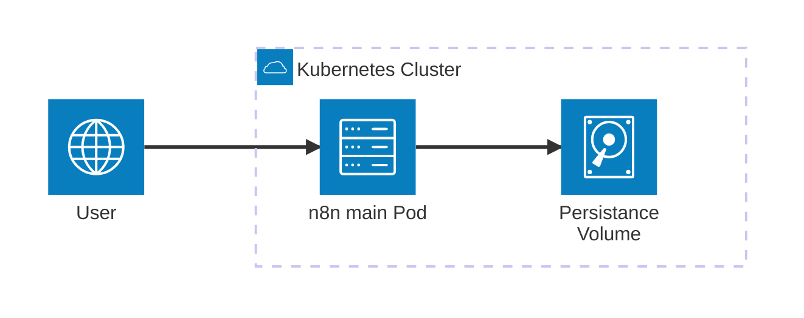
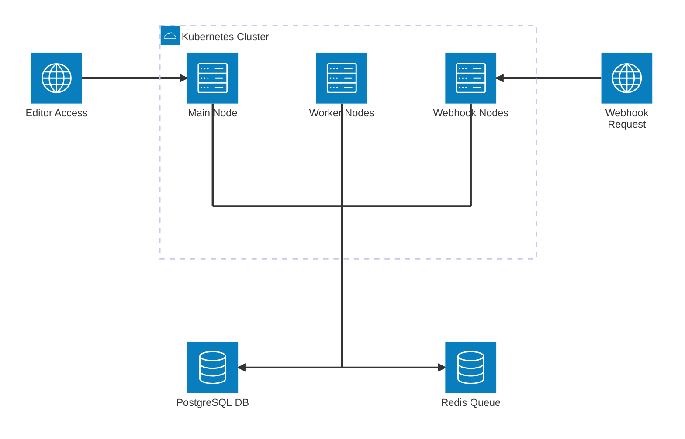

```mermaid
architecture-beta
  group k8s(cloud)[Kubernetes Cluster]

  group mainpod(blank)[Main Pod] in k8s
  service main(server)[Main Node] in mainpod
  service mainrunner(server)[External Runner] in mainpod

  main:B <--> T:mainrunner

  group workerpod(blank)[Worker Pods] in k8s
  service worker(server)[Worker Node] in workerpod
  service workerrunner(server)[External Runner] in workerpod

  worker:B <--> T:workerrunner
```

# N8N Chart Usage

[n8n](https://n8n.io) is a powerful workflow automation tool that lets you connect apps and automate tasks with a no-code/low-code interface. This chart makes it easy to run n8n on Kubernetes with enterprise-grade features.

:::info
**Quick Links:**
- **Official Website:** [https://n8n.io](https://n8n.io)
- **GitHub Repository:** [https://github.com/n8n-io/n8n](https://github.com/n8n-io/n8n)
- **Documentation:** [https://docs.n8n.io](https://docs.n8n.io)
- **ArtifactHub:** [n8n Helm Chart](https://artifacthub.io/packages/helm/community-charts/n8n)
:::

## Why use this chart?

:::tip
**Enterprise Ready:** This chart provides production-grade features that make n8n suitable for enterprise environments and team collaboration.
:::

- **Production Ready:** Deploy n8n reliably on Kubernetes with enterprise features
- **Community Maintained:** Regularly updated and well-tested
- **Scalable Architecture:** Support for queue mode, worker nodes, and webhook nodes
- **Flexible Configuration:** Multiple database backends, external storage, and monitoring
- **Security Focused:** Built-in security contexts, secrets management, and RBAC support
- **Advanced Node Support:** **Unique npm package installation capabilities** - Install custom npm packages and community nodes directly in main and worker pods
- **External Task Runners:** **Only Helm chart supporting external task runners** - Isolate workflow execution in dedicated sidecar containers for enhanced security and performance

:::info
**Unique Features:** This chart offers capabilities not available in other n8n Helm charts, making it the preferred choice for advanced deployments.
:::

## Quick Start

### Prerequisites

:::warning
**Requirements:** Ensure you have all prerequisites installed and configured before proceeding with the installation.
:::

- Kubernetes cluster (1.19+)
- Helm 3.0+
- kubectl configured
- Storage class for persistent volumes (if using PostgreSQL/MinIO)
- **If using Google Cloud SQL (PostgreSQL) on GKE:** You must use the Cloud SQL Proxy sidecar. See [Google Cloud SQL (GCP) with Cloud SQL Proxy](./database-setup.md#google-cloud-sql-gcp-with-cloud-sql-proxy) for details.
- **If using AWS RDS/Aurora or Azure Database for PostgreSQL:** See [AWS RDS/Aurora](./database-setup.md#aws-rdsaurora-postgresql) and [Azure Database for PostgreSQL](./database-setup.md#azure-database-for-postgresql) for cloud-specific setup and troubleshooting.

:::danger
**Cluster Compatibility:** Ensure your Kubernetes cluster version is compatible with the chart requirements to avoid deployment issues.
:::

### Basic Installation

```bash
# Add the repository
helm repo add community-charts https://community-charts.github.io/helm-charts
helm repo update

# Install n8n with default settings (SQLite)
helm install my-n8n community-charts/n8n -n <your-namespace>
```

:::tip
**For Development:** The basic installation with SQLite is perfect for testing and development environments. For production, consider using PostgreSQL with queue mode.
:::

:::warning
**Data Persistence:** SQLite data is stored in the pod and will be lost if the pod is deleted. Use PostgreSQL for production deployments.
:::

### Production Installation with PostgreSQL

```bash
# Install with PostgreSQL backend
helm install my-n8n community-charts/n8n \
  --set db.type=postgresdb \
  --set postgresql.enabled=true \
  --set postgresql.auth.database=n8n \
  --set postgresql.auth.username=n8n \
  --set postgresql.auth.password=your-secure-password \
  -n <your-namespace>
```

:::note
**Security:** Always use strong, unique passwords for database credentials. Consider using Kubernetes secrets for sensitive data.
:::

:::danger
**Production Database:** Never use SQLite in production. PostgreSQL provides better performance, reliability, and supports queue mode features.
:::

### Installation with Ingress

```bash
# Install with ingress for external access
helm install my-n8n community-charts/n8n \
  --set ingress.enabled=true \
  --set ingress.hosts[0].host=n8n.yourdomain.com \
  --set db.type=postgresdb \
  --set postgresql.enabled=true \
  -n <your-namespace>
```

:::warning
**External Access:** Configure proper TLS certificates and security headers when exposing n8n through ingress.
:::

### Queue Mode Installation (Production)

```bash
# Install with queue mode for distributed execution
helm install my-n8n community-charts/n8n \
  --set db.type=postgresdb \
  --set postgresql.enabled=true \
  --set redis.enabled=true \
  --set worker.mode=queue \
  --set webhook.mode=queue \
  --set webhook.url=https://webhook.yourdomain.com \
  --set ingress.enabled=true \
  --set ingress.hosts[0].host=n8n.yourdomain.com \
  -n <your-namespace>
```

:::tip
**Production Recommendation:** Queue mode with PostgreSQL and Redis is the recommended setup for production environments. It provides better scalability, reliability, and performance.
:::

:::info
**Queue Mode Benefits:** Queue mode enables distributed execution, better resource utilization, and improved reliability for high-volume workflows.
:::

:::tip
**Cloud Redis:** For managed Redis on GCP, AWS, or Azure, see [Cloud Redis Setup](./cloud-redis.md).
:::

## Key Features

:::info
**Feature Overview:** These features make n8n production-ready and suitable for enterprise environments.
:::

### Database Support
- **SQLite** (default) - Simple single-node deployments
- **PostgreSQL** - Production-ready with Bitnami PostgreSQL or external instances

:::warning
**Database Choice:** SQLite is suitable only for development and testing. Use PostgreSQL for all production deployments.
:::

### Deployment Modes
- **Regular Mode** - Single n8n instance (default)
- **Queue Mode** - Distributed execution with worker nodes
- **Webhook Mode** - Dedicated webhook processing nodes

:::tip
**Mode Selection:** Choose the deployment mode based on your workload requirements and scalability needs.
:::

### Storage Options
- **Default** - In-memory binary data storage
- **Filesystem** - Local file storage
- **S3-Compatible** - External object storage (AWS S3, MinIO, etc.)

:::info
**Storage Strategy:** Use S3-compatible storage for production environments to ensure data persistence and enable team collaboration.
:::

### Monitoring & Observability
- **Prometheus Metrics** - Built-in metrics endpoint
- **ServiceMonitor** - Prometheus Operator integration
- **Health Checks** - Liveness and readiness probes
- **Logging** - Configurable log levels and outputs

:::tip
**Monitoring Setup:** Enable monitoring to track n8n performance, identify bottlenecks, and ensure reliable operation.
:::

### Security Features
- **RBAC Support** - Kubernetes role-based access control
- **Security Contexts** - Non-root container execution
- **Secrets Management** - Kubernetes secrets integration
- **Network Policies** - Pod-to-pod communication control

:::warning
**Security Configuration:** Always configure proper security contexts and RBAC policies for production deployments.
:::

## Unique Features

:::tip
**Exclusive Capabilities:** These features make this n8n Helm chart stand out from all others available.
:::

### Advanced npm Package Management
This chart provides **exceptional npm package installation capabilities** that set it apart from other n8n Helm charts:

- **Custom npm Packages:** Install any npm package directly in main and worker pods
- **Community Nodes:** Seamlessly install n8n community nodes for extended functionality
- **Private Registries:** Support for private npm registries with authentication
- **Automatic Reinstallation:** Smart package management with automatic reinstallation of missing packages
- **Built-in Modules:** Configure access to Node.js built-in modules for enhanced Code node capabilities

:::info
**Package Management:** This feature enables advanced workflow capabilities by allowing custom npm packages and community nodes.
:::

### External Task Runners (Exclusive Feature)
This is the **only n8n Helm chart** that supports external task runners, providing enhanced security and performance:

- **Isolated Execution:** Run workflow executions in dedicated sidecar containers
- **Enhanced Security:** Separate execution environment from the main n8n application
- **Resource Isolation:** Dedicated resource allocation for task execution
- **Scalability:** Independent scaling of execution capacity
- **Enterprise Ready:** Production-grade isolation for sensitive workflows

:::warning
**Enterprise Feature:** External task runners are only available in n8n Enterprise. Make sure you have the appropriate license if using this feature.
:::

:::danger
**License Requirement:** External task runners require an n8n Enterprise license. Verify your license before enabling this feature.
:::

## Architecture Overview

:::info
**Deployment Options:** Choose the architecture that best fits your use case and requirements.
:::

The n8n Helm chart supports three main deployment architectures:

### Single Node (Default)



:::tip
**Single Node Use:** Perfect for development, testing, and small-scale deployments with low workflow volumes.
:::

### Queue Mode (Production)



:::info
**Queue Mode Benefits:** Provides horizontal scaling, better resource utilization, and improved reliability for production workloads.
:::

### External Task Runners



:::tip
**External Runners:** Provides enhanced security and performance isolation for sensitive workflows.
:::

## Examples

:::info
**Real-world Scenarios:** These examples demonstrate practical deployment patterns for different use cases.
:::

Check out the [examples directory](https://github.com/community-charts/examples/tree/main/n8n-examples) for complete deployment scenarios:

- [Workers and Webhooks](https://github.com/community-charts/examples/tree/main/n8n-examples/workers-and-webhooks-example) - Queue mode with dedicated nodes
- [Community Nodes](https://github.com/community-charts/examples/tree/main/n8n-examples/community-nodes-packages-example) - Custom npm packages
- [External Task Runners](https://github.com/community-charts/examples/tree/main/n8n-examples/internal-and-external-npm-packages-with-external-runner-example) - Isolated execution environments

:::tip
**Example Usage:** Study these examples to understand best practices and common deployment patterns.
:::

## Upgrading

```bash
# Update the repository
helm repo update

# Upgrade the release
helm upgrade my-n8n community-charts/n8n -n <your-namespace>
```

:::note
**Backup First:** Always backup your data before upgrading, especially when changing database configurations.
:::

:::warning
**Upgrade Testing:** Test upgrades in a staging environment before applying to production.
:::

## Uninstalling

```bash
# Uninstall the release
helm uninstall my-n8n -n <your-namespace>

# Optionally delete PVCs (WARNING: This will delete all data)
kubectl delete pvc -l app.kubernetes.io/instance=my-n8n -n <your-namespace>
```

:::danger
**Data Loss Warning:** Deleting PVCs will permanently remove all n8n data including workflows, executions, and credentials. Make sure you have backups before proceeding.
:::

:::warning
**Uninstall Confirmation:** Double-check the namespace and release name before uninstalling to avoid accidental data loss.
:::

## Support

:::info
**Need Help?** We're here to help you succeed with your n8n deployment.
:::

- **GitHub Issues:** [Report bugs or request features](https://github.com/community-charts/helm-charts/issues)
- **Discussions:** [Community discussions](https://github.com/community-charts/helm-charts/discussions)
- **Documentation:** [n8n official docs](https://docs.n8n.io)

:::tip
**Community Support:** Join our community discussions to get help from other users and share your experiences.
:::

## Next Steps

:::tip
**Getting Started:** Follow these guides in order for a complete n8n setup experience.
:::

- [Configuration Guide](./configuration.md) - Detailed configuration options
- [Database Setup](./database-setup.md) - PostgreSQL and external database configuration
- [Queue Mode Setup](./queue-mode.md) - Distributed execution with Redis
- [Storage Configuration](./storage.md) - Binary data storage options
- [Monitoring Setup](./monitoring.md) - Metrics and observability
- [Troubleshooting](./troubleshooting.md) - Common issues and solutions
