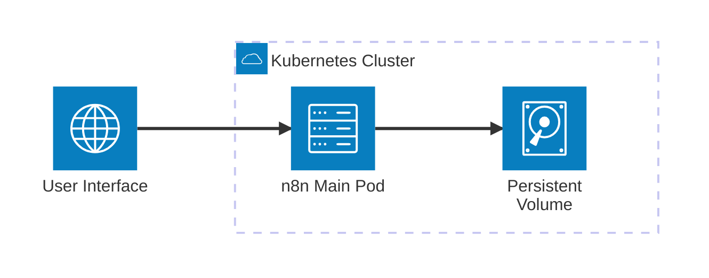
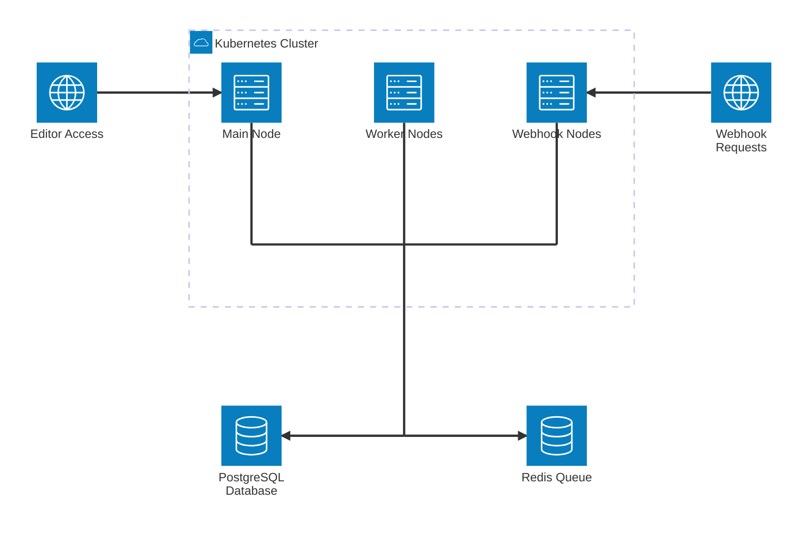

# n8n Chart Usage Guide

[n8n](https://n8n.io) is a powerful workflow automation platform that enables seamless integration between applications and services through an intuitive visual interface. This Helm chart provides a production-ready deployment solution for running n8n on Kubernetes with enterprise-grade features and scalability.

:::info
**Quick Reference:**
- **Official Website:** [https://n8n.io](https://n8n.io)
- **GitHub Repository:** [https://github.com/n8n-io/n8n](https://github.com/n8n-io/n8n)
- **Documentation:** [https://docs.n8n.io](https://docs.n8n.io)
- **ArtifactHub:** [n8n Helm Chart](https://artifacthub.io/packages/helm/community-charts/n8n)
:::

## Why Choose This Chart?

:::tip
**Enterprise-Grade Solution:** This chart delivers production-ready features that transform n8n into a robust enterprise automation platform.
:::

### Key Advantages

- **Production-Ready Architecture:** Deploy n8n with enterprise-level reliability and performance
- **Community-Driven Development:** Continuously maintained and thoroughly tested by the community
- **Scalable Design:** Advanced queue mode with dedicated worker and webhook nodes
- **Flexible Configuration:** Support for multiple database backends, external storage, and comprehensive monitoring
- **Security-First Approach:** Built-in security contexts, secrets management, and RBAC integration
- **Advanced Package Management:** **Exclusive npm package installation capabilities** - Deploy custom npm packages and community nodes directly within main and worker pods
- **External Task Runners:** **Unique external task runner support** - Execute workflows in isolated sidecar containers for enhanced security and performance

:::info
**Distinctive Features:** This chart offers capabilities unavailable in other n8n Helm charts, establishing it as the preferred solution for sophisticated deployments.
:::

## Quick Start Guide

### Prerequisites

:::warning
**System Requirements:** Ensure all prerequisites are properly installed and configured before proceeding with deployment.
:::

#### Required Components
- Kubernetes cluster (version 1.19 or higher)
- Helm 3.0 or higher
- kubectl configured for cluster access
- Storage class for persistent volumes (required for PostgreSQL/MinIO deployments)

#### Cloud-Specific Requirements

**Google Cloud Platform (GKE):**
- For Google Cloud SQL (PostgreSQL) deployments, Cloud SQL Proxy sidecar is mandatory
- Refer to [Google Cloud SQL Setup](./database-setup.md#google-cloud-sql-gcp-with-cloud-sql-proxy) for detailed configuration

**AWS/Azure:**
- For AWS RDS/Aurora deployments, see [AWS RDS/Aurora Configuration](./database-setup.md#aws-rdsaurora-postgresql)
- For Azure Database for PostgreSQL, see [Azure Database Setup](./database-setup.md#azure-database-for-postgresql)

:::danger
**Version Compatibility:** Verify your Kubernetes cluster version meets the chart requirements to prevent deployment failures.
:::

### Basic Deployment

```bash
# Add the community charts repository
helm repo add community-charts https://community-charts.github.io/helm-charts
helm repo update

# Deploy n8n with default configuration (SQLite backend)
helm install my-n8n community-charts/n8n -n <your-namespace>
```

:::tip
**Development Environment:** The basic SQLite deployment is ideal for development, testing, and evaluation purposes. For production environments, we recommend PostgreSQL with queue mode.
:::

:::warning
**Data Persistence Warning:** SQLite data is ephemeral and will be lost upon pod termination. Implement PostgreSQL for production deployments requiring data persistence.
:::

### Production Deployment with PostgreSQL

```bash
# Deploy with PostgreSQL backend for production use
helm install my-n8n community-charts/n8n \
  --set db.type=postgresdb \
  --set postgresql.enabled=true \
  --set postgresql.auth.database=n8n \
  --set postgresql.auth.username=n8n \
  --set postgresql.auth.password=your-secure-password \
  -n <your-namespace>
```

:::note
**Security Best Practice:** Always employ strong, unique passwords for database credentials. Consider utilizing Kubernetes secrets for sensitive configuration data.
:::

:::danger
**Production Database Requirement:** SQLite is unsuitable for production environments. PostgreSQL delivers superior performance, reliability, and supports advanced queue mode functionality.
:::

### External Access Configuration

```bash
# Deploy with ingress for external access
helm install my-n8n community-charts/n8n \
  --set ingress.enabled=true \
  --set ingress.hosts[0].host=n8n.yourdomain.com \
  --set db.type=postgresdb \
  --set postgresql.enabled=true \
  -n <your-namespace>
```

:::warning
**Security Configuration:** When exposing n8n through ingress, ensure proper TLS certificate configuration and security headers are implemented.
:::

### Enterprise Queue Mode Deployment

```bash
# Deploy with queue mode for distributed execution and high availability
helm install my-n8n community-charts/n8n \
  --set db.type=postgresdb \
  --set postgresql.enabled=true \
  --set redis.enabled=true \
  --set worker.mode=queue \
  --set webhook.mode=queue \
  --set webhook.url=https://webhook.yourdomain.com \
  --set ingress.enabled=true \
  --set ingress.hosts[0].host=n8n.yourdomain.com \
  -n <your-namespace>
```

:::tip
**Production Recommendation:** Queue mode with PostgreSQL and Redis represents the optimal configuration for production environments, providing enhanced scalability, reliability, and performance characteristics.
:::

:::info
**Queue Mode Benefits:** Queue mode enables distributed workflow execution, improved resource utilization, and enhanced reliability for high-volume automation scenarios.
:::

:::tip
**Managed Redis Services:** For cloud-managed Redis on GCP, AWS, or Azure, refer to [Cloud Redis Configuration](./cloud-redis.md).
:::

## Core Features

:::info
**Feature Overview:** These capabilities transform n8n into a comprehensive enterprise automation platform.
:::

### Database Integration
- **SQLite** (default) - Simplified single-node deployments for development
- **PostgreSQL** - Enterprise-grade database support with Bitnami PostgreSQL or external instances

:::warning
**Database Selection:** SQLite is appropriate solely for development and testing scenarios. PostgreSQL is mandatory for all production deployments.
:::

### Deployment Architectures
- **Standard Mode** - Single n8n instance deployment (default configuration)
- **Queue Mode** - Distributed execution architecture with dedicated worker nodes
- **Webhook Mode** - Specialized webhook processing nodes for high-throughput scenarios

:::tip
**Architecture Selection:** Choose the deployment architecture based on your workload requirements, scalability needs, and performance objectives.
:::

### Advanced Endpoint Support (Queue Mode)
- **MCP Endpoints** - Model Context Protocol integration for AI assistant connectivity
- **Form Endpoints** - Interactive web form generation for workflow trigger mechanisms
- **Webhook Endpoints** - High-performance HTTP webhook processing for external system integration

:::info
**Queue Mode Requirement:** MCP and Form endpoints are exclusively available in queue mode deployments utilizing PostgreSQL database.
:::

:::tip
**AI Integration Capabilities:** MCP endpoints facilitate seamless interaction between AI models, assistants, and n8n workflows through the Model Context Protocol.
:::

#### MCP Service and Client Integration

n8n now provides a dedicated MCP webhook service and endpoints for scalable AI/LLM integration:

- **MCP Endpoint:** `/mcp/` (for AI assistants, LLMs, and tool clients)
- **MCP Test Endpoint:** `/mcp-test/`
- **MCP Webhook Service:** Deployed automatically when `webhook.mode=queue` and `db.type=postgresdb` and `webhook.mcp.enabled`

##### Example values.yaml for MCP

```yaml
webhook:
  mode: queue
  url: "https://webhook.yourdomain.com"
  count: 2
  mcp:
    enabled: true
    # Customize resources, affinity, env, etc. under webhook.mcp
```

##### MCP Client Settings (Claude Desktop, Cursor, etc.)

:::tip
[Supergateway](https://github.com/supercorp-ai/supergateway) runs MCP stdio-based servers over SSE (Server-Sent Events) with one command.
:::

```json
{
  "mcpServers": {
    "command": "npx",
    "args": [
      "-y",
      "supergateway",
      "--sse",
      "https://webhook.myhost/mcp/ab123c45-d678-9d0e-fg1a-2345bcd6ef7g"
    ]
  }
}
```

With header authentication:

```json
{
  "mcpServers": {
    "command": "npx",
    "args": [
      "-y",
      "supergateway",
      "--sse",
      "https://webhook.myhost/mcp/ab123c45-d678-9d0e-fg1a-2345bcd6ef7g",
      "--header",
      "mykey:myvalue"
    ]
  }
}
```

- Set these in Claude Desktop, Cursor, or any compatible MCP client.
- Use `--header` for custom authentication (API keys, tokens, etc).

:::tip
**Scaling:**
- Scale the MCP service with `webhook.count`, `webhook.autoscaling`, or `webhook.allNodes`.
- Customize resources, affinity, and environment variables under `webhook.mcp`.
:::

### Storage Solutions
- **Default Storage** - In-memory binary data storage for simple deployments
- **Filesystem Storage** - Local file system storage for single-node scenarios
- **S3-Compatible Storage** - External object storage integration (AWS S3, MinIO, and compatible services)

:::info
**Storage Strategy:** Implement S3-compatible storage for production environments to ensure data persistence and enable collaborative team workflows.
:::

### Monitoring and Observability
- **Prometheus Metrics** - Comprehensive built-in metrics endpoint
- **ServiceMonitor Integration** - Seamless Prometheus Operator compatibility
- **Health Monitoring** - Configurable liveness and readiness probe mechanisms
- **Logging Framework** - Flexible log level configuration and output management

:::tip
**Monitoring Implementation:** Enable comprehensive monitoring to track n8n performance metrics, identify potential bottlenecks, and ensure operational reliability.
:::

### Security Framework
- **RBAC Integration** - Kubernetes role-based access control implementation
- **Security Contexts** - Non-root container execution for enhanced security
- **Secrets Management** - Kubernetes secrets integration for sensitive data
- **Network Policies** - Pod-to-pod communication control and isolation

:::warning
**Security Configuration:** Always implement proper security contexts and RBAC policies for production deployments to ensure compliance and protection.
:::

### Pod Affinity and Anti-Affinity
- **Advanced Scheduling** - Control pod placement with affinity rules
- **Node Distribution** - Spread pods across nodes for high availability
- **Zone Distribution** - Distribute pods across availability zones
- **Resource Optimization** - Co-locate pods with specific node types

:::tip
**Scheduling Strategy:** Utilize affinity rules to optimize resource utilization and improve availability. Configure separate affinity rules for main, worker, and webhook nodes to achieve optimal performance.
:::

:::warning
**Configuration Deprecation:** The top-level `affinity` field is deprecated. Implement specific affinity configurations under `main`, `worker`, and `webhook` blocks for enhanced control.
:::

### Enhanced Persistence Support
- **Multi-Node Persistence** - Complete persistence solution for main, worker, and webhook nodes
- **StatefulSet Integration** - Automatic StatefulSet selection for optimal persistence configuration
- **Autoscaling Compatibility** - ReadWriteMany support for dynamic autoscaling deployments
- **Flexible Storage Options** - Custom storage classes, existing PVC integration, and volume annotations
- **Access Mode Optimization** - ReadWriteOnce for StatefulSets, ReadWriteMany for autoscaling scenarios

:::info
**Persistence Architecture:** Main nodes store workflows and configuration data, while worker nodes maintain npm packages for accelerated startup times. Webhook nodes utilize Deployments and do not support persistence.
:::

:::warning
**Autoscaling Considerations:** Worker nodes configured with `ReadWriteOnce` persistence cannot utilize autoscaling functionality. Implement `ReadWriteMany` for autoscaling or `ReadWriteOnce` with StatefulSets for fixed scaling deployments.
:::

## Unique Features

:::tip
**Distinctive Capabilities:** These exclusive features establish this n8n Helm chart as the premier solution for advanced automation deployments.
:::

### Advanced npm Package Management
This chart delivers **unparalleled npm package installation capabilities** that distinguish it from all other n8n Helm charts:

- **Custom npm Package Deployment** - Direct installation of any npm package within main and worker pods
- **Community Node Integration** - Seamless deployment of n8n community nodes for extended functionality
- **Private Registry Support** - Comprehensive support for private npm registries with authentication
- **Intelligent Package Management** - Automated package reinstallation for missing dependencies
- **Built-in Module Access** - Configured access to Node.js built-in modules for enhanced Code node capabilities

:::info
**Package Management Benefits:** This capability enables sophisticated workflow automation by facilitating custom npm packages and community node integration.
:::

### External Task Runners (Exclusive Feature)
This represents the **only n8n Helm chart** supporting external task runners, delivering enhanced security and performance:

- **Execution Isolation** - Workflow execution within dedicated sidecar containers
- **Security Enhancement** - Complete separation of execution environment from the main n8n application
- **Resource Isolation** - Dedicated resource allocation for task execution processes
- **Scalability Optimization** - Independent scaling of execution capacity
- **Enterprise-Grade Isolation** - Production-level isolation for sensitive workflow execution

:::warning
**Enterprise License Requirement:** External task runners are exclusively available in n8n Enterprise. Ensure you possess the appropriate license before implementing this feature.
:::

:::danger
**License Verification:** External task runners mandate an n8n Enterprise license. Verify your license status before enabling this advanced functionality.
:::

## Deployment Architecture Overview

:::info
**Architecture Selection:** Choose the deployment architecture that optimally aligns with your use case and operational requirements.
:::

The n8n Helm chart supports three primary deployment architectures:

### Single Node Architecture (Default)



:::tip
**Single Node Applications:** Ideal for development, testing, and small-scale deployments with minimal workflow volumes.
:::

### Queue Mode Architecture (Production)



:::info
**Queue Mode Advantages:** Delivers horizontal scaling capabilities, optimized resource utilization, and enhanced reliability for production workloads.
:::

### External Task Runner Architecture

```mermaid
architecture-beta
  group k8s(cloud)[Kubernetes Cluster]

  group mainpod(blank)[Main Pod] in k8s
  service main(server)[Main Node] in mainpod
  service mainrunner(server)[External Runner] in mainpod

  main:B <--> T:mainrunner

  group workerpod(blank)[Worker Pods] in k8s
  service worker(server)[Worker Node] in workerpod
  service workerrunner(server)[External Runner] in workerpod

  worker:B <--> T:workerrunner
```



:::tip
**External Runner Benefits:** Provides enhanced security and performance isolation for sensitive workflow execution.
:::

## Implementation Examples

:::info
**Practical Deployment Patterns:** These examples demonstrate real-world deployment scenarios for various use cases and requirements.
:::

Explore the [comprehensive examples directory](https://github.com/community-charts/examples/tree/main/n8n-examples) for complete deployment scenarios:

- [Workers and Webhooks Configuration](https://github.com/community-charts/examples/tree/main/n8n-examples/workers-and-webhooks-example) - Queue mode with dedicated node architecture
- [Community Nodes Integration](https://github.com/community-charts/examples/tree/main/n8n-examples/community-nodes-packages-example) - Custom npm package deployment
- [External Task Runners Setup](https://github.com/community-charts/examples/tree/main/n8n-examples/internal-and-external-npm-packages-with-external-runner-example) - Isolated execution environment configuration

:::tip
**Example Implementation:** Study these examples to understand industry best practices and common deployment patterns for optimal results.
:::

## System Maintenance

### Upgrade Procedures

```bash
# Update the repository to latest version
helm repo update

# Perform system upgrade
helm upgrade my-n8n community-charts/n8n -n <your-namespace>
```

:::note
**Data Protection:** Always perform comprehensive data backups before upgrading, particularly when modifying database configurations.
:::

:::warning
**Upgrade Validation:** Conduct thorough upgrade testing in a staging environment before implementing changes in production.
:::

### System Removal

```bash
# Remove the n8n deployment
helm uninstall my-n8n -n <your-namespace>

# Optional: Remove persistent volume claims (WARNING: This will permanently delete all data)
kubectl delete pvc -l app.kubernetes.io/instance=my-n8n -n <your-namespace>
```

:::danger
**Data Loss Warning:** Deleting persistent volume claims will permanently remove all n8n data including workflows, executions, and credentials. Ensure comprehensive backups are available before proceeding.
:::

:::warning
**Removal Confirmation:** Verify the namespace and release name before uninstalling to prevent accidental data loss.
:::

## Support and Resources

:::info
**Community Support:** We're committed to helping you achieve success with your n8n deployment.
:::

### Support Channels
- **GitHub Issues:** [Report bugs or request features](https://github.com/community-charts/helm-charts/issues)
- **Community Discussions:** [Engage with the community](https://github.com/community-charts/helm-charts/discussions)
- **Official Documentation:** [n8n official documentation](https://docs.n8n.io)

:::tip
**Community Engagement:** Participate in our community discussions to receive assistance from other users and share your deployment experiences.
:::

## Next Steps

:::tip
**Implementation Guide:** Follow these guides sequentially for a comprehensive n8n deployment experience.
:::

- [Configuration Guide](./configuration.md) - Comprehensive configuration options and parameters
- [Database Setup](./database-setup.md) - PostgreSQL and external database configuration
- [Queue Mode Setup](./queue-mode.md) - Distributed execution with Redis integration
- [Storage Configuration](./storage.md) - Binary data storage and persistence options
- [Monitoring Setup](./monitoring.md) - Metrics, observability, and alerting configuration
- [Troubleshooting](./troubleshooting.md) - Common issues, solutions, and diagnostic procedures
